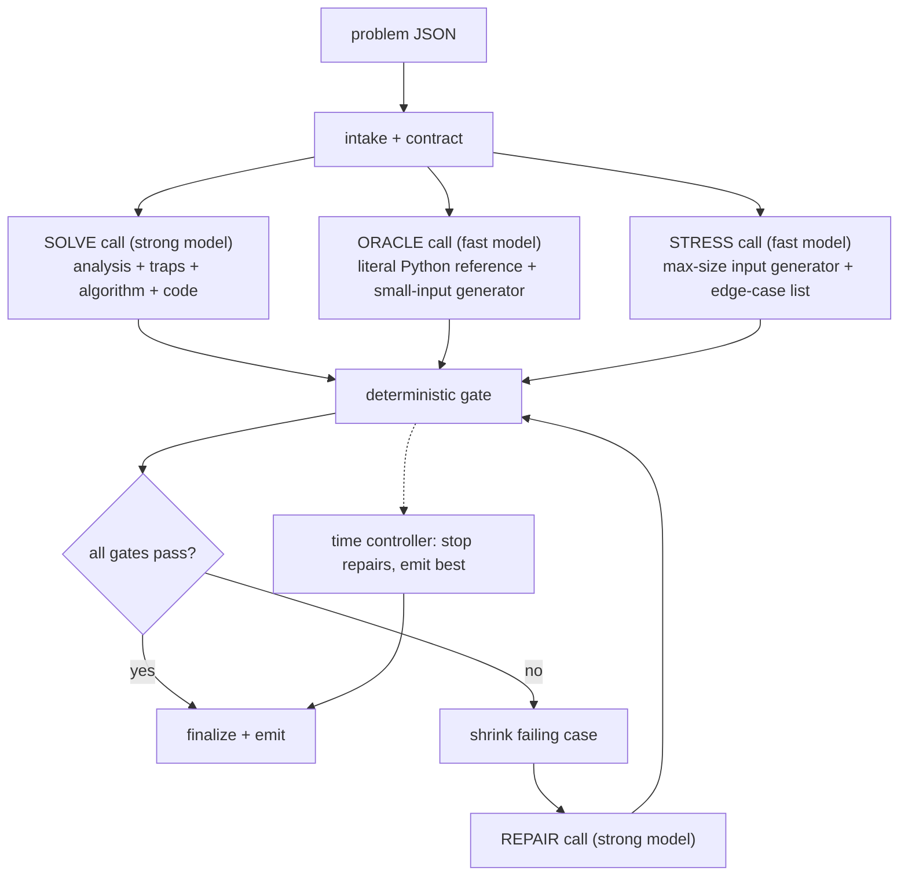

# ChallengeBox AI Solver — Architecture

**See [`SOLVER.md`](SOLVER.md) for setup and usage.** This document is the design rationale.

**Status:** implementation-ready
**Deliverable:** a runnable tool: `python solve.py <problem.json> -o <solution file>`
**Scope:** one week, one developer

---

## 1. What is being scored

Each problem is worth 0 or 1. A point requires all of the following at once:

- solution file emitted before `deadline_s`;
- passes every hidden test, including edge cases and maximum-size inputs;
- obeys the language contract (Python: named function, stdlib only, no I/O; Rust: `fn main()`, stdin/stdout, stdlib only).

Consequences that shape the design:

- A compiling but wrong solution is worth the same as no solution. "Best effort" fallback is a consolation, not a feature.
- A correct but slow solution is worth nothing. Performance must be tested, not estimated.
- No public examples are guaranteed. All ten samples have none. The system must manufacture its own ground truth.
- Cost matters. The README asks for cost optimization in the architecture, so the design states a per-problem budget.

---

## 2. What the samples say

The ten problems in `samples/` are the specification. Reading them yields a consistent profile.

| Property | Observed |
|---|---|
| `public_examples` | empty in all ten (see §5.4.1: when non-empty, this is the only ground truth in the system that isn't manufactured by a model, and is treated accordingly) |
| `deadline_s` | 300 in all ten |
| Languages | 6 Python, 4 Rust |
| Statement length | 2–3 KB, dense, formal |
| A parameter ≥ 10^18 that forbids direct simulation | all ten |

### 2.1 Trap classes found in the samples

| Trap | Where it appears | What kills a naive solution |
|---|---|---|
| Counts up to 10^18 | run-length outcome counts, `repeat` factors, `default k`, demand `k`, capacities | any loop over the count |
| Structures that cannot be built | flattened schema layouts "may be enormous"; DAG unfolding is exponential; "do not enumerate individual cells" | materializing the structure |
| Persistence and branching | versions created from any earlier version `b < i` | copying state per version |
| Unbounded range reversal | 200k `reverse(left, right)` ops with no bound on total length | list slicing, O(n²) |
| Deep recursion in Python | path depth "may be linear in the node count" (250k) | any recursive traversal |
| Big integers in Rust | sums and products of values up to 10^18 | `i64`/`u64` overflow |
| Custom Unicode rules | grapheme rules stated in the problem, deliberately not Unicode's | a model applying the "real" algorithm from memory |
| Wording that redefines behavior | "implicitly returns error after runs are exhausted", "restoration writes even if another activation changed the cell", "disregard every removed tab other than the selected tab" | reading the general idea instead of the sentence |

### 2.2 Contracts stated in the samples

Python problems say: deterministic, stdlib only, no I/O, no global state, do not mutate supplied arguments, return exact types.

Rust problems say: one program with `fn main()`, stdlib only, no `unsafe`, no filesystem, no network, no nondeterminism, stdin/stdout only, output compared as ASCII-whitespace-separated tokens.

Every one of these is mechanically checkable. Section 6 checks them.

### 2.3 The good news

Every sample is a state machine or simulation with a literal, small-scale interpretation. A brute-force reference that follows the statement sentence by sentence is always writable for tiny inputs. That reference is the ground truth the hidden tests withhold, so building it is mandatory, not optional.

---

## 3. Design principles

1. **The statement is the spec, not the model's memory.** Every prompt instructs the model to derive rules from the text and to flag where the text contradicts a well-known algorithm.
2. **Evidence beats confidence.** A model saying "correct" is not evidence. Compilation, contract checks, differential agreement with an independent oracle, and a passed max-size stress run are.
3. **Independence is the source of truth.** The oracle is generated in a separate context, from the statement alone, in Python regardless of target language, with instructions to be literal and slow. It never sees the candidate.
4. **Speed is a gate, not an audit.** Every candidate runs on a generated maximum-size input under a wall-clock limit before it can be finalized.
5. **The deadline is a clock, not a prompt.** A monotonic budget controller assigns every model call and every subprocess a timeout derived from time remaining.
6. **Few calls, run in parallel.** Roughly five serious model calls fit in 300 seconds. Independent calls are issued concurrently.
7. **Lazy plumbing.** One provider, one CLI command, five source files. Effort goes into verification, not scaffolding.

---

## 4. Pipeline



The three generation calls run concurrently, and preparation of the gate's inputs overlaps them: the orchestrator waits for the ORACLE reply first and starts building the small and medium differential tiers immediately, while the SOLVE and STRESS calls are still in flight (§5.3). Each SOLVE reply is then built into a candidate and **gated as it lands**, while any other attempt is still running (§5.3). The gate is deterministic and costs no tokens. The repair loop runs at most twice against a semantic (behavioral) failure and, independently, at most twice against a mechanical (static/compile) one — see §5.7. The time controller can interrupt at any point and finalize.

### 4.1 Time budget for a 300-second problem

Usable time is `deadline_s` minus a 15-second safety margin. Phases are expressed as percentages so other deadlines scale.

| Window (s) | Share | Phase | Allowed |
|---:|---:|---|---|
| 0–5 | 2% | intake | parse, validate, build contract, start clock |
| 5–95 | 30% | generate | three concurrent model calls, each capped at `[phases].generate_call_share` (config.toml, default 0.70) of usable time — since they run concurrently, the phase costs max() of the three, not their sum, so each can get most of the phase rather than a third of it; role caps underneath: strong 120 s, fast 150 s |
| 95–115 | 7% | gate | compile, contract checks, differential, stress |
| 115–235 | 40% | repair | up to two shrink → repair → gate cycles, each capped at `verify.repair_cap` and started only while that cap plus one gate pass (~60 s) still fits, plus at most one fresh solve (§5.7) under the same rule with the generate cap |
| 235–270 | 12% | settle | no new model calls; the last gate result stands; write report |
| 270–285 | 5% | emit | write the solution file atomically |
| 285–300 | 5% | margin | reserved; never scheduled |

The windows above are advisory, not enforced boundaries: the only phase cutoff the orchestrator
actually checks is the repair loop's (it will not start another repair once `Budget.phase()` has left
`repair`). What guarantees the deadline is `step_timeout` — every model call and every subprocess is
capped at the remaining time minus a reserve — plus the `safety_margin_s` that is subtracted from
`deadline_s` before any of this arithmetic, not the phase table. That is deliberate: enforcing the
generate window as a hard cutoff would kill the ORACLE call at ~95 s, below its measured 38–128 s
latency, and a run with no oracle verifies nothing.

### 4.2 Why this fits

Serious reasoning calls take 20 to 90 seconds each. A sequential analyzer → architect → judge → coder → critic → tester → repairer chain is seven calls before the first verified candidate and does not fit. This design issues three calls at once, then spends the remaining time on deterministic checks and at most two repairs. Worst case is five model calls plus one optional adjudication call and one optional fresh solve.

---

## 5. Stages

### 5.1 Intake

- Parse JSON; require `problem_id`, `language ∈ {python, rust}`, `statement`, `entrypoint`, `deadline_s > 0`.
- Compute `safe_deadline = monotonic() + deadline_s - margin`.
- Build the contract: Python → `def <entrypoint>(...)` must exist; Rust → `fn main()` must exist.
- Invalid input exits with code 2 before any model call.

### 5.2 SOLVE call (strong model, one call)

One structured response with six sections. Merging analysis and code into one call halves latency and keeps the analysis in the same context that writes the code, which is where it matters.

Required sections:

In the order the prompt asks for them:

1. **Rules** — a numbered restatement of every behavioral sentence in the statement, quoting the text, capped at about 25 lines. Ambiguities listed separately with the chosen reading.
2. **Design** — state representation, the invariant per operation, complexity at the stated maxima, one hand trace of the hardest boundary, and an explicit rejection of any approach that iterates a huge bounded count or materializes an enormous structure.
3. **Code** — in a fenced block with a fixed marker. The orchestrator extracts by marker, never by trusting prose.
4. **Examples** — 3–5 hand-traced `(args, expected)` pairs, machine-readable (§5.2.1).
5. **Traps** — for each constraint, what a naive approach would do and why it fails. The prompt lists the trap classes from §2.1 as a checklist the model must address one by one.
6. **Algorithm** — data structures, complexity against the stated maximum sizes, overflow treatment, recursion treatment.

RULES comes *before* CODE. The earlier "code first" ordering was measured against reasoning models that
filled the token budget with prose before reaching the code; the configured strong model returns 2–4k
tokens with no reasoning block, so a short quoted restatement first is affordable — and it is the
restatement, not the code, that catches a misreading of the statement. The orchestrator parses by
marker, so the order is a prompt decision only.

The prompt carries one optional section on top of those six, `{{previous_attempt}}`, which is empty
for the concurrent generation calls and filled in only for a **fresh solve** (§5.7.1): the failed
attempt's algorithm and code, and the concrete failure that ended it.

Language-specific instructions baked into the prompt:

- Python: iterative traversals only; no globals; no mutation of arguments; no recursion on data whose depth can be large.
- Rust: read all stdin into one buffer, `BufWriter` for output, `i128`/`u128` for sums of 10^18 quantities, `BTreeMap` or sorted output where iteration order reaches stdout, no `unsafe`.

On top of those, one **I/O contract per language** (`solve.py`'s `io_rules`) is rendered verbatim into SOLVE, REPAIR, ORACLE and STRESS, so the candidate and the oracle cannot each pick a different, individually defensible reading of the same shape. For Rust it is the stdin token-stream rule (§5.4). For Python it is the outer container: return exactly the types the statement names — the judge compares with `==`, so `()` is not `[]` — and where the statement names none, a `list` for the returned sequence and a `tuple` only where it says tuple or pair. Three rounds running, both of 2beff58fa923's attempts returned `()` where the oracle returned `[]` on the empty input, and a repair attempt was spent on a difference the statement is silent about.

#### 5.2.1 Hand-traced examples: a second reading of the statement

The SOLVE reply carries one more block, `===EXAMPLES===`: three to five lines, each a Python literal
`(args, expected)` pair (for Rust, the complete stdin and the complete stdout as strings), traced from the
statement by hand and explicitly not obtained by running the code. The prompt asks for the smallest legal
input, one input at a stated numeric limit, and the input the author thinks is most likely to be misread — and it
asks for all of them to be *in contract*: every example must satisfy every precondition the statement states, and
every container in it must be spelled the way the same `{{io_rules}}` the oracle and stress authors receive says it
is. Both halves are paid for in lost checks: an out-of-contract input is rejected by the oracle's `validate()` and
dropped (3 of 10 examples on bench14, 2 of 8 on bench15), and a container spelled the other way round is rejected
until the respelling retry rescues it.

`verify.parse_examples` reads them with one restricted evaluation per line — never `exec`, this is model output.
The grammar is Python literals plus integer arithmetic (`+ - * ** // %` and unary sign over `int` constants, with
magnitudes capped at 10^40 and exponents at 10^4); names, calls, attributes and comprehensions are rejected, and a
`*` whose operand is a container or a string is rejected rather than repeated. `ast.literal_eval` alone refused
`10**18`, so on bench15 the candidate lost both of the traces covering the very limit the statement is built around
while the other candidate, which spelled the same constant as `1000000000000000000`, lost nothing. It then
drops any line that is not a 2-tuple (the count is reported per candidate as `examples: {count, dropped}`),
wraps non-tuple Python args as a 1-tuple, requires a `str` for Rust, and caps the list at 8. They are used twice:

- **Against the candidate** — gate step `diff_examples` (§5.5), immediately after compile and before every
  other differential step. A failure means the code contradicts its own author's reading of the statement, and
  it drives the normal repair loop with `kind=diff_examples`; the repair prompt's *Expected* line then says the
  value came from the solution author's own hand trace rather than from the reference. That failing case is
  **not** shrunk and **not** kept as a regression: shrink re-derives the expectation from the oracle, which
  would silently swap one ground truth for the other. A repaired child inherits its parent's examples.
- **Against the oracle** — `prepare_gate_inputs` runs the oracle's `validate()` and `reference()` over every
  distinct example input (the union across all candidates, deduped by `repr(args)`) and records
  `example_checks = {cases, disagreements, errors}`, which reaches `report.json` under `gate_inputs`. The
  oracle never sees the examples in its own prompt; this is a reading it did not write.

When the oracle contradicts at least half of at least two hand-traced inputs (`verify.examples_disputed`), it
is **disputed**: the same one-shot self-repair path §5.3.1 uses regenerates it, with the disputed inputs and
their hand-traced expected values as the extra context — inputs and expected values only, never any candidate
code. If the replacement still contradicts half of them, every `diff_*` step of the run is marked degraded
(`reference disagrees with hand-traced examples on X of N`) and the status can no longer be
`passed_all_gates`. If instead the replacement agrees with all of them, the §5.7 cross-check's "neither
reference can be trusted" degradation is *not* applied to their wholesale disagreement: the examples are
outside evidence saying which of the two references was wrong.

This is the generic replacement for a sample-specific smoke check that briefly existed and was deleted: it
scores on every problem rather than one, and it costs no extra model call.

### 5.3 ORACLE call (fast model, concurrent)

Produces three Python functions in one response:

- `reference(args)` — the literal simulation. Told: "Follow the statement sentence by sentence. Loop where the statement loops. Build what the statement describes. Ignore efficiency. Inputs will be tiny." For Rust problems it takes the parsed stdin text and returns the expected stdout tokens.
- `gen(seed, size)` — a seeded generator of small valid inputs. Told to honor every validity constraint in the statement, to include boundary values (empty, single element, equal values, adjacent positions), and to include a `medium` mode with counts around 10^4 to 10^5 so closed-form arithmetic in the candidate is exercised where the literal reference still finishes in seconds. A third mode, `large`, builds one input at the statement's stated maximum (or as large as three seconds of bulk construction reaches) purely so the timing gate has an input when STRESS's `gen_max` is unusable — §5.4. Nothing ever runs `reference()` on it.
- `validate(args)` — **defined as "`reference()` did not raise `ValueError`"**, and nothing else. The prompt gives the four-line template verbatim, and `verify._ensure_validate` appends it when the model forgot it (a `validate` the model *did* write is kept — the harness does not fight it). The reason is measured: asked for a separate predicate, every model wrote a token-shape and range parser, so every precondition that depends on evolving state ("must currently exist", "never declared") went unenforced and out-of-spec inputs became ground truth (round-10 L4, five of ten runs). Two consistent functions written from one precondition list is more than a fast model delivers; one function is. So `reference()` is told to `raise ValueError` at the point any stated precondition is violated — and told just as firmly that an operation the statement *itself* calls invalid and specifies a result for is not a precondition violation but an ordinary case with a specified answer. Any other exception out of `reference()` (`IndexError`, `KeyError`, …) is a bug in the reference, not an invalid input, and is counted as one (§5.3.1). Every input the gate uses goes through `validate`: both `gen` tiers, the STRESS edge list, every max-size candidate input (`gen_max`'s, then `gen(seed, "large")`'s — a rejection moves on to the next source rather than gating on an input the statement forbids) and every input the shrinker invents (§5.6). `verify._validate_inputs` is the single place that call is made; a validate that crashed or timed out on an input gives no verdict, which is not a rejection, and a validate that rejected a whole tier is distrusted exactly as before. When a tier is distrusted AND `reference()` returned the same answer for inputs that differ, those are two independent signals that the oracle cannot parse this input format at all: the tier is emptied with a note rather than used to fail a candidate for printing the right answer. The cost of the definition is one extra `reference()` call per input, which is why the per-case and batch limits apply to the validation pass exactly as to the reference pass.

The oracle is Python for both target languages. For Rust problems this gives a second language and free big integers, which removes the risk that oracle and candidate share an overflow.

The oracle writes the largest output of the three concurrent calls (three functions, not one), so it is reliably the slowest and the one most likely to hit its timeout. If the first attempt returns no `===ORACLE===` block at all (a timeout, most often), the orchestrator retries the ORACLE call exactly once — a local counter, not a `GateInputs` field — guarded by `budget.can_afford(130)` (the measured worst-case oracle latency is 128 s) so the retry never fires this close to the deadline. This is independent of `regenerate_oracle` (§5.7), which reissues the oracle for two different reasons, each with its own separate one-shot counter (§5.3.1 and §5.7).

Before any generated oracle or stress source is executed, a fixed preamble — `import random, math, itertools, collections, string, heapq, bisect` — is prepended to it. The prompt tells the model to *use* `random.Random(seed)` but never explicitly tells it to import anything, and one live run produced a module with no imports at all, whose `gen()` died with `NameError`. A duplicate import is harmless if the model already wrote one. The preamble is prepended to the exact string that gets written to disk as that run's `cand.py`, so any traceback line number always matches what's actually sitting in the run directory — it only differs from the raw LLM completion's own line count.

**Preparation overlaps the other two calls.** `prepare_gate_inputs` is split into three phases over one `GateInputs`: `prepare_oracle_tiers` (public examples, the `small` and `medium` differential tiers, the validate/gen reject fraction) needs only the ORACLE reply; `prepare_stress_inputs` (the `EDGES` fixtures and the max-size timing input) needs the STRESS reply; `check_oracle_examples` needs the SOLVE replies, since the hand-traced examples arrive with them. The orchestrator therefore waits for the oracle first, runs its retry/self-repair decision, and starts the tiers while the other calls are still outstanding — logged as `prep.overlap solve_pending=<n>`. On bench14 the oracle landed at 30 s, stress at 51 s and prep did not begin until 51 s, finishing at 62 s: eleven seconds that were free, and with a slow strong model the whole preparation is. The work is subprocess-bound, so it runs in the orchestrator's own thread rather than in the pool, whose workers belong to the model calls. `prepare_gate_inputs` remains as the all-at-once wrapper for `regenerate_oracle`, which has every input in hand.

**One attempt by default.** `[limits] solve_attempts` is 1. Two concurrent attempts were tuned to a 17 s non-reasoning coder model, where the second cost nothing but tokens — N attempts cost `max()` latency, not `sum()`. A thinking model spends 150–200 s on a solve, which is most of the deadline, so the second attempt stops being free: it leaves no room for the repair loop, and bench16 lost a run to a one-line boundary bug a repair could have fixed. One attempt plus a repair at low effort (§5.7) is the better trade at this latency, and it halves the per-problem cost. Raise it back to 2 when the *oracle* is the suspect rather than the solution: the two-candidates-agree dispute (§5.7) is the strongest evidence the system has that the reference is the wrong side, and it needs two candidates to exist. Everything below holds for any N.

**Each candidate is gated as its own reply arrives.** The orchestrator used to join on every SOLVE attempt before gating any of them, which idled 43 s on bench15 and 31 s on bench16 — with a thinking model in the strong role one attempt can be 40 s behind the other or run all the way into its cap and return nothing. The solve futures are now consumed with `as_completed`: each reply is turned into a candidate (examples parsed, `check_oracle_examples` run over the examples of every candidate so far) and put through a full gate pass immediately, logged as `gate.early cand=<id> solve_pending=<n>`; a reply that timed out or carried no code simply produces no candidate. Two consequences are worth naming. Candidate ids follow the order replies *land*, not the order attempts were submitted. And the example check accumulates while the dispute decision does not: a verdict reached on the first candidate is not re-opened by the second unless that second candidate contributed a value disagreement nobody had seen, and the one oracle self-repair a run is allowed stays one.

**The `medium` tier is time-boxed, not phase-gated.** It is the most expensive evidence per second and the least decisive, so it gets at most `[limits] medium_tier_budget_s` (default 20 s) for the generator batch and the reference batch together; if the generator alone spends it, medium ships 0 cases with the note `medium tier: time box exhausted`. It used to be *dropped* once the budget left the `gate` phase, which cost bench14 its only mid-size tier twice over: 60.3 s to produce 6 cases, which the oracle regeneration then discarded, and the re-prep skipped the tier entirely with time still on the clock. A box bounds the cost without ever silently dropping the tier, and the same rule applies to a regenerated oracle's re-prep.

#### 5.3.1 Oracle self-repair: the CALL can succeed while the CODE is unusable

The retry above reacts to the ORACLE call itself failing (timeout, empty reply). A different, later-discovered failure mode is silent by comparison: the call succeeds, `oracle_src` parses, but `reference()`, `gen()`, or `validate()` then raise at runtime on every input they're given — an f-string referencing an undefined name, a `gen()` unpacking its own tuple wrong, a missing import. `prepare_gate_inputs` already detects and records every one of these (`"reference failed on all small inputs: <traceback>"`, `"gen(medium) produced nothing: <traceback>"`), but until this fix nothing acted on the detection: no gate step fails (there is nothing to check against), so the run proceeds with zero verification and ships silently as `emitted_unverified`.

After `prepare_gate_inputs` returns, `verify.oracle_unusable(gi)` asks the one generic question that covers every variant of this failure without hardcoding which function or which tier broke: did the oracle yield **no usable case at all, in every generated tier** (`cases_small`, `cases_medium`, `cases_edge` all empty)? Public examples don't factor into this check either way — they're ground truth from the problem, not something the oracle produced, so they say nothing about whether the oracle itself is usable.

When the oracle is unusable and the budget can still afford one more oracle-shaped call (`[limits].oracle_selfrepair_afford_s`, same cost profile as the initial call and its retry), the orchestrator calls `regenerate_oracle` — the same function §5.7's adjudication path uses — passing it the collected failure notes (the actual tracebacks the broken code produced) as the extra context appended to the statement, so the model can see exactly what its own code did wrong. `prepare_gate_inputs` then reruns against whatever new source comes back.

**Second trigger: the oracle that rejects its own inputs.** The same one-shot path fires on a second, equally silent failure — the oracle runs fine, but its `validate()` throws out most of what its own `gen()` produced. Round 8 ended four of ten runs as `emitted_unverified` on exactly this: 30 of 32 small inputs rejected on 2beff58fa923, 163 of 200 small and 17 of 20 medium on 5d02bd0e16ab, 46 of 55 on 6eca8a9120e0, and the independent STRESS author's edges and `gen_max` rejected along with them. On 5d02bd0e16ab the cause was visible in the source: `validate` re-modelled the state machine more loosely than `gen`, never recording the versions `R` created, so every later reference to a version ≥ 1 was "invalid". `gen` and `validate` are two readings of the same precondition list, so a disagreement that wholesale means one of them misreads the statement — and gating on the handful of survivors, or on inputs one half of the oracle calls illegal, is worth less than one more oracle call. `prepare_gate_inputs` therefore records rejected/checked per tier (`make_cases` keeps up to two rejected inputs as evidence) and stores the small+medium ratio as `GateInputs.validate_reject_frac`; at or above `[limits] validate_reject_frac_regen` (default 0.5) the self-repair fires. An input whose `reference()` raised something other than `ValueError` counts toward that same ratio: with `validate` defined as "the reference did not raise `ValueError`", a reference that crashes is an unusable oracle, and while those were recorded only as "errors" they could never fire the regeneration. Tiers where `validate` was distrusted (it rejected everything, or there is none) are excluded — they say nothing about a *disagreement* — and the edge tier is recorded but excluded from the ratio, appearing in the prompt as independent corroboration since those inputs came from the STRESS author, not from this oracle's `gen()`. The extra context quotes the counts and the rejected inputs and asks for the preconditions to be re-listed and both functions written from that one list, with one `gen()` output traced through `validate()` — and, like every oracle call, contains no candidate material. The prompt itself was tightened to match (§5.3). Unlike the crash trigger, this one has something to lose: if the replacement rejects at least as much of its own output, or comes back with no cases at all, it is discarded and the original oracle is kept.

The existing budget guard (`[limits] oracle_selfrepair_afford_s`) and the cost cap apply to both triggers unchanged.

This has its **own one-shot counter**, `GateInputs.oracle_selfrepairs`, entirely independent of `oracle_regens` (§5.7's adjudication counter) — `regenerate_oracle` takes a `counter` argument naming which field to increment, so the two recovery paths never share a budget. A run can recover from a broken oracle early on via self-repair and still adjudicate a genuine candidate/oracle disagreement later via the repair loop; both can fire, once each, in the same run. Both counts are reported (`oracle_selfrepaired`, `oracle_regenerated`), and the trigger is logged distinctly (`oracle.selfrepair ...`) so it's visible in `report.json`'s `events` separately from an adjudication regeneration (`oracle.regen ...`).

### 5.4 STRESS call (fast model, concurrent)

Produces `gen_max(seed)` — one input at every stated maximum simultaneously (max N, max Q, max values, max nesting, deepest recursion path, worst-case operation mix), plus a short list of hand-picked edge cases as literal inputs.

Two rules in that prompt come from bench14, where `gen_max` returned three operations, no `default` at all, and a repetition count its own author capped at 10 000 with the comment `# keep rep smallish to avoid blowup` — against a statement bounding repetitions, capacities and default counts by 10^18. First: a count, repetition, capacity or multiplier that appears *inside* the input is a number, not work — writing `10**18` costs the generator nothing whatever the structure it describes would cost to build — so every quantity the statement bounds by a huge number must appear at its stated maximum at least once, in an operation the candidate actually has to process. Second: the input must stay valid in the statement's own sense all the way to its end, because a statement that stops at the first invalid operation discards everything after it — bench14's first operation named an identifier the input never created, so 476 KB were answered at operation 1. Deliberately invalid operations go last, or into `EDGES`.

The whole module is imported to read either of them, so the prompt forbids anything running at import time except `import` statements, `def`s and the `EDGES = [...]` literal: on 1ba0d34fae43 the STRESS source asserted its own `EDGES` at module level against rules the statement never stated, the import raised, and the edges and `gen_max` were lost together — the call bought nothing.

For Rust, both `EDGES` entries and `gen_max`'s output are stdin text, and each is dedented per line (leading/trailing whitespace stripped on every line) before it reaches the gate. Model-written `EDGES` are Python triple-quoted string literals indented to match the surrounding list, so every continuation line inherits that indentation; fed verbatim, a line-oriented Rust parser sees `"    41".parse::<u64>()` and fails. The judge never sends indented input — the README defines Rust I/O as ASCII-whitespace-separated tokens — so the indentation is purely source formatting and is stripped, not preserved.

**A verdict the validator could not give is not an acceptance.** `_accept_stress_input` records one of three verdicts for the max-size input: `accepted`, `rejected` (move on to the next source, as before) and `unjudged` — validate() crashed or timed out on it, or this run has no trusted validate() at all. `unjudged` used to be silently treated as `accepted`. On bench15 `gen_max` returned a structure nested 200 000 deep against a stated cap of 60; the literal reference could not finish on it, so there was no verdict, and both candidates — one of them correct and ≤ 0.74 s on every legal maximum — were killed at the timing cap by an input the statement forbids, and the run shipped `emitted_with_failures`. The input is still *used* (an indicative timing beats none), but the resulting `stress` evidence carries `detail.degraded = "max-size input could not be validated (reference did not finish); timing is indicative only"` and is recorded as **skipped whichever way it went**: a pass is a skipped pass (status `emitted_unverified` at best) and a failure is a skipped pass too — it never fails the candidate, never routes to repair, and never spends a fresh solve on evidence nothing can confirm. This is generic over every problem whose constraints include a bound the literal oracle cannot evaluate — huge counts, enormous structures, exponential unfoldings — which is exactly the class where timing matters most. The other half of the fix is in `prompts/stress.md` (§5.4): `gen_max` must assert every stated bound — counts, lengths, values, and the structural ones (nesting or reference depth, chain length, tree height) — against the input it is actually about to return, and raise rather than return an input that breaks one.

**Where the max-size input comes from, in order.** `gen_max(seed)` is tried first and validated; it failed or was rejected in nine of ten round-10 runs, and it was the only source there was, so the timing check had nothing to run on. Second is the ORACLE call's own `gen(seed, "large")` — the same state model as its `small`/`medium` modes, driven to the statement's stated maximum or to whatever it can build in about three seconds, written in the oracle's own context from the same statement, and run under the same sandbox timeout and memory limits as `gen_max`. It is validated the same way, and one extra check applies: an oracle whose `gen()` ignores its `mode` argument answers `"large"` with a small input, so an input no larger than the biggest case in the generated tiers (or one with no tier to compare against at all) is marked degraded rather than trusted as max-size. Whichever source is used is logged as `stress.input source=gen_max|gen_large|medium_degraded validity=accepted|unjudged|unvalidated size=<bytes>` and recorded in `gate_inputs.stress_source` / `gate_inputs.stress_validity` in the report. The 50 MB harness output cap and the statement's own stated limits apply to every source.

If both generators fail and at least one `medium`-tier case exists, the stress input falls back to the largest of those medium cases — "largest" measured as `len(str(case.input))`, which is generic across a Python argument tuple (its `str()` scales with total content) and a Rust stdin string (its `str()` is the string itself) without knowing anything about the problem's shape. This gives the timing check *something* to run rather than skipping it outright, but a medium case is capped far below `gen_max`'s target scale — it is not a maximum-size input. The resulting `stress` evidence is marked `detail.degraded`, and a *passing* degraded run is additionally recorded as `skipped`: finishing inside the limit on a smaller-than-maximum input is not evidence the candidate is fast enough, so it must not count as a passed gate (the status is `emitted_unverified` at best). A degraded run that was still **too slow** is kept as a real failure — too slow on a below-maximum input is only more damning. With no medium case either, the stress step is skipped exactly as before.

The same `detail.degraded` marker covers thin coverage. A `diff_small` or `diff_medium` step that passed on fewer cases than `[limits] min_cases_small` / `min_cases_medium` (config.toml; defaults 30 and 5 against the 200/20 targets) is marked degraded by `run_gate`: agreement on a handful of inputs means the oracle's `gen()` mostly crashed or its `validate()` rejected most of what it produced, and one run was observed shipping as a full pass on 48 small and 4 medium cases. An empty tier is `skipped`, not degraded. In the finalizer, any evidence carrying `detail.degraded` counts exactly like a skipped step: the status becomes `emitted_unverified` rather than `passed_all_gates`, and `benchmark.md` shows the cell as `degraded`. The gate order and the repair loop are unaffected — degraded evidence still *passed*; it is only weaker than the name of the step claims. A third source of `detail.degraded` is an oracle regeneration that disagrees with the oracle it replaced (§5.7): that marks every `diff_*` step of the run.

A fourth source is a stress run that finished faster than any real work could. The timing gate times the candidate but never checked that the candidate actually *consumed* the input: on bench14 `gen_max`'s first operation named an identifier its own input never created, so the candidate discarded a 476 KB input at operation 1 and the gate recorded a pass for a solution needing ~10^11 s at the stated limits. A *passing* `stress` whose measured duration is below `[limits] stress_min_plausible_s` (default 0.01 s) now records `detail.suspicious` (`finished in <d> s on a <n>-byte input; the input may not exercise the candidate`), carries it as `detail.degraded` and is recorded as `skipped` — never as a pass. It is generic over every early-exit shape (first-invalid-index answers, validators, short-circuiting searches) and costs no tokens; its one known false positive is a genuinely O(1) closed-form answer, which loses "pass" for "degraded" and nothing else.

For this to mean anything, `duration_s` had to become the candidate's own time. The Python harness started its clock before `ast.literal_eval` and `copy.deepcopy` of the arguments, which cost ~0.10 s on a 50 000-element input and are identical for every candidate — so a candidate doing no work at all and one doing all of it read as 0.103 s and 0.105 s, and `duration_s` measured input size rather than work. The clock now starts immediately before the call. The judge hands the function real objects, so that setup was never part of what is being timed.

### 5.5 Deterministic gate

Runs in order, cheapest first. Only a failed compile/import stops it: past that, **every step the inputs allow runs**, and the evidence list is complete rather than truncated at the first failure. Three reasons (round-10 L2): the timing steps need no oracle, so a differential failure must not suppress them — seven of ten round-10 solutions were asymptotically wrong and the system had timing data on none of them, because `stress` sat last in a short-circuiting chain; the per-tier mismatch counts are what `candidate_score` ranks candidates on, and half of them used to be missing; and a timing failure and a correctness failure want different responses (§5.7), which cannot be chosen if only one of the two was ever measured. The repair prompt stays focused anyway: `solve()` repairs the **first** failed step in the canonical order below, so a correctness failure is still repaired before a timing one. The cost is bounded — each differential tier is seconds, the expensive tier (medium) keeps its own budget rule, and every step turns itself into `skipped: no budget` once `step_timeout` returns 0.

1. **Static contract** — §6.
2. **Compile / import** — Rust: `rustc -O -C overflow-checks=on --edition 2021`. On a compile failure the `use ...;` lines rustc itself suggested are prepended and the compile is retried once (`sandbox.compile_rust_with_imports`, zero model tokens — two benchmark runs in a row lost a candidate to a missing `use std::io::Read;`); the patched source becomes the candidate's source, so it is what the rest of the gate, a later repair, and the emitted file all use. Python: `compile()` then import in a subprocess.
3. **Hand-traced examples** — the `===EXAMPLES===` block of the SOLVE reply: 3–5 `(args, expected)` pairs the solution's author traced from the statement by hand, run against that same candidate. No oracle is involved, so this is the one differential step a wrong reference cannot poison. Skipped (never failed) when the reply carried no parseable examples (§5.2.1) — and, alone among skipped steps, that skip does not demote the run's status: the absence of the block is prompt compliance, not evidence the gate failed to collect, and the "at least one real check ran" rule (§5.8) is what catches a run that verified nothing.
4. **Public examples** — `problem.public_examples`, compared directly, only present if the problem shipped any (§5.4.1).
5. **Edge cases** — the literal cases from STRESS, compared against `reference`.
6. **Differential, small** — 200 seeded cases from `gen(seed, "small")`, candidate vs `reference`.
7. **Differential, medium** — 20 seeded cases from `gen(seed, "medium")`.
8. **Behavioral contract** — §6.3 checks (mutation, global state, nondeterminism), run on the same cases.
9. **Stress** — `gen_max` input, release build (`overflow-checks=off`, for a realistic timing measurement), wall-clock limit (default Python 5 s, Rust 2 s, configurable; the real judge limits are unknown and this is recorded as an assumption).
10. **Overflow (Rust only)** — immediately after stress, so the timing run above happens first on a warm cache and this step can't mask a stress timeout. Reruns the same `gen_max` input on the overflow-checked binary already compiled by step 2 (reused, not recompiled). This is the only place a genuinely maximum-size input meets an overflow-checked build: step 2's checked build is only ever exercised by the small/medium differential inputs, which are far too small to overflow i64. A panic here (Rust prints `attempt to add with overflow` and similar) fails the step. **This does not check the output is correct** — the oracle is a literal Python reference and cannot produce an expected answer at maximum scale in reasonable time — it only proves no arithmetic operation overflowed. Skipped (not failed) when the problem is Python (arbitrary-precision integers, nothing to overflow), when there is no stress input, or when the budget is exhausted.

#### 5.4.1 Public examples: the one non-model-generated evidence source

`Problem.load` has always parsed `public_examples`, but until this fix nothing downstream consumed it — every sample in `samples/` ships an empty list, which is exactly why the gap went unnoticed. When a hidden problem does ship examples, they are the single most trustworthy evidence available: real input/output pairs from whoever set the problem, not a model's guess at either the algorithm or the ground truth.

Parsing is defensive by necessity — the shape is whatever the problem author chose, sight unseen. `verify._parse_public_examples` recognizes a dict with an input key (`input`/`args`/`in`/`params`) and an output key (`output`/`expected`/`result`/`out`/`answer`), or a bare two-element `[input, output]` pair; anything else is skipped with a note (`public_examples[i]: unrecognized shape, skipped`) rather than guessed at or allowed to crash the run.

These become `GateInputs.cases_public` — and they are treated differently from every other case tier in three ways:

- **Never validated.** They don't pass through the oracle's `validate()` (§5.5's input-validation paragraph): they're already known-good, and running an unrelated model-written predicate over them could only incorrectly discard real ground truth.
- **Never dropped on a `reference()` disagreement.** Every other tier throws away an input `reference()` can't produce an answer for. A public example is never thrown away — if the oracle's `reference()` disagrees with (or crashes on) a public example, `_check_public_against_oracle` reads that as evidence **the oracle is wrong**, not the example: it's recorded in `gate_inputs.notes` and attached to the `diff_public` evidence's `oracle_disagreements` detail, and the public example is still checked against the candidate exactly as given.
- **Run first.** `diff_public` is its own evidence kind, run in `run_gate` immediately after compile/import and before any generated tier, so a candidate that fails real ground truth fails fast on the most trustworthy evidence in the system, before spending time on model-manufactured cases.

With no public examples — the overwhelming common case — `cases_public` is empty and the `diff_public` step is not added to the evidence list at all; the gate is byte-for-byte what it was before this existed.

**Input validation, before steps 5–7.** Every input feeding those three steps (STRESS edge cases and both `gen` tiers) is first checked against the oracle's own `validate`, batched the same way as the `reference` pass. An input `validate` rejects, or raises on, is dropped as invalid before `reference` ever computes an expected output for it, so the differential never burns a case — or a repair attempt — chasing a candidate/oracle disagreement on input the statement itself forbids. Two safety rules keep this from doing more harm than good: if `validate` would reject *every* input in a tier, it is distrusted instead — all inputs for that tier are kept exactly as before, and the report records that the validator was skipped; and an oracle with no `validate` function at all behaves exactly as it did before this feature existed, with its own distinct skip reason in the report. This buys confidence that inputs reaching the gate satisfy the preconditions the statement states; **it does not buy correctness of `reference` itself** — an oracle whose `reference` misreads the statement can still be internally consistent with its own `validate` and pass every check.

Each step produces an `Evidence` record: kind, passed, case count, duration, and the failing input if any.

When there is no oracle source at all (both the first attempt and its one retry produced no `===ORACLE===` block), every differential/behavior/stress step is `skipped` rather than run, which makes `all_passed()` true even though nothing was actually checked. This is deliberately *not* turned into a candidate-repair failure — repairing the candidate cannot conjure an oracle, and it would burn both repair attempts for nothing — so the run's status is still the accurate `emitted_unverified`. What changes is the log: this case is logged as `gate.unverifiable`, naming why (from `gate_inputs.notes`), instead of `gate.passed`, so the log doesn't read as a success for a run that verified nothing.

### 5.6 Shrink

On a differential failure, a bounded greedy shrink (max 3 seconds): drop list elements, halve integers, shorten strings, drop trailing operations, keep the change only if the failure persists. A four-line counterexample makes the repair call both cheaper and more accurate than a 300-line one. Shrinking only applies to Python's structured arguments; for Rust, where the failing input is stdin text, `shrink` returns the case unshrunk and the repair prompt gets the original counterexample. A sequence that started non-empty is never shrunk to empty: the failure usually still reproduces with the list emptied, and the repair model, shown a counterexample in which the operation never happens, deletes the code that handles it (6e43a08ec05a). The greedy order — halves first, then single deletions — makes the kept witness the smallest non-empty one the loop can reach. A shrunk input is also checked against the oracle's `validate()` (when that validate is trusted, §5.3) before it is accepted: the shrinker knows nothing about the statement's preconditions, and driving an id to 0 or emptying a list manufactures an input the statement forbids. Such a step is rejected like one that stops reproducing the failure — otherwise the phantom drives the repair call and is kept as a regression case that fails every later candidate forever (1dea32802072).

### 5.7 REPAIR call (strong model, two independent budgets)

Input: statement, the current code, the gate step that failed, the shrunk input, expected vs actual (each shown as `repr()` *and* its Python type, so an empty tuple and an empty list — indistinguishable by eye, `()` vs `[]`, but not by type — can't be mistaken for the same value), and the time remaining. Instruction: smallest change that fixes the demonstrated failure; keep the public contract; do not switch algorithms unless the failure proves the algorithm wrong. The model is first required to name, in one sentence, the specific expression or line producing the wrong value, then change only what that sentence names — a whole-approach rewrite is almost never the right response to one failing input, and a model that believes the approach itself is wrong is told to say so rather than rewrite silently. When the candidate being repaired is itself the output of an earlier repair, the prompt says so explicitly: the earlier failing input, a diff of what that repair changed, and a flat statement that the change did not fix the case — so the model doesn't re-propose the same edit.

**Two counters, not one.** A gate failure of kind `static` or `compile` is mechanical (a missing import, a missing `mut`) rather than a semantic defect, and is charged against `[limits].max_syntax_repairs` (default 2). Every other failure kind (`diff_*`, `behavior`, `stress`, `overflow`) is charged against `[limits].max_repairs` (default 2). The two budgets are independent — a run can spend up to `max_syntax_repairs` fixing compile errors *and* up to `max_repairs` fixing an algorithmic bug, but a `static` failure can never crowd out a semantic repair attempt or vice versa. Both counts (`repairs`, `syntax_repairs`) are in the report. The overall repair loop is still bounded by the same phase and cost checks (`run.budget.phase()`, `max_cost_usd_per_problem`), and by one budget rule that now follows the configured model rather than a literal. **A repair call is capped at `verify.repair_cap` — the larger of `[phases] repair_call_share * usable` and the strong role's own `repair_cap_s` — and is started only while `budget.remaining()` covers that cap plus one gate pass; otherwise the loop logs `repair.skipped reason=budget` and the call is never made.** The fraction alone gave bench16 a 67 s repair against a role whose completed solve that run took 168 s: the call could only time out, and the 67 s were spent proving it. The same rule governs a fresh solve, with the full generate cap as its price. **A repair call that errors — transport failure, 4xx/5xx, timeout, or a reply with no marker block — yields no verdict at all**: it is logged as `repair.error`, mints no child, and the loop stops as if the repair had been skipped. It used to fall through to the default verdict `candidate` ("the reference is right"), which on bench16-1dea was recorded for a 403 on a run whose oracle was the wrong side.

**Post-gate calls think less.** `Role.repair_extra` (a TOML table per role) is merged over `Role.extra` for the two tags in `llm.REPAIR_TAGS` — `repair` and `solve_fresh` — and `config.toml` sets `reasoning = { effort = "low" }` there for the OpenRouter strong role, against `medium` for the initial solve. After the gate the deadline is measured in tens of seconds, not hundreds. Which knob a provider takes stays in role config, never in a branch in `llm.py`, which only knows which of a role's two extras a given tag gets; a fresh solve therefore carries its own tag (`solve_fresh`) through `Run.chat`, the log, `report.json`'s `calls` and the `FakeLLM` script.

**Two candidates agreeing is a dispute, and it comes before any repair.** When the candidate that would go to repair failed a differential tier at the same input index, with the same answer, as another candidate from a different lineage (`verify.candidates_agree`: roots and fresh solves are different authors, a repaired child is not a second author of its parent's reading, and a crash or timeout — which the evidence renders as `(no answer: …)` — is never an agreement), that is two independently sampled readings of the statement against the reference's one. It is recorded as one value disagreement in `example_checks`, in the same shape as a hand-traced example and flagged `from_candidates` so no prompt calls it a hand trace — so it can tip `examples_disputed` and tell a regeneration's cross-check which of the two references was the wrong one. And it takes the **oracle regeneration path before any candidate repair**, subject to the same one-regeneration budget, carrying only the case as evidence (the input, the value both solutions produced, the value the reference produced — never any code). The candidate is then re-gated against the replacement: if it agrees with them the failure is gone, and if it still disagrees the next pass repairs the candidate exactly as before. The lookup is disabled once a regeneration has happened, because the other candidate's evidence then refers to a different oracle's case list and its index means something else. On bench16-1dea both candidates produced identical output on the failing input, a hand-traced example contradicted the oracle on the same rule, the oracle had one wrong conjunct — and the repair was aimed at the candidates. Logged as `oracle.dispute two_candidates_agree kind=… index=… authors=…`.

**Adjudication.** When candidate and oracle disagree, the oracle may be the wrong one. The repair prompt is told this and asked to hand-trace the shrunk case against the statement and say which side is wrong. If it names the oracle, `verify.regenerate_oracle` is called with the disputed input and what the current reference answered on it — **and nothing else**. The repair model's own prose about the candidate used to be appended here; on 1dea32802072 the regenerated oracle then inherited the candidate's exact bug and agreed with the wrong candidate on 4000/4000 inputs. The oracle is generated in its own context and never sees the candidate, so the extra context is the input, the previous answer, and one neutral sentence asking for the expected output to be re-derived from the statement alone. The call increments `GateInputs.oracle_regens` and fires at most once; when the verdict is `oracle` and no regeneration is left (already used, or it failed), the loop logs `repair.oracle_verdict_unactionable` and stops instead of adding the repair's deliberately-unchanged CODE block as a new candidate (1c182498c9c7 emitted such a candidate). Regeneration is given the same generous timeout as the original ORACLE call — derived from `[phases].generate_call_share`, not a separate smaller fraction — because it writes the same `reference`/`gen`/`validate` functions and is just as likely to need the full span; `step_timeout` still caps it to whatever budget remains. This is the same `regenerate_oracle` function §5.3.1 uses for self-repair, parameterized by which counter to increment (`counter="oracle_regens"` here vs. `"oracle_selfrepairs"` there) so the two one-shot budgets never collide — both can fire, once each, in the same run.

A regenerated oracle is then cross-checked against the one it replaces: the new `reference()` reruns the old `cases_small` inputs and the disagreement is logged as `oracle.regen disagreement=k/n` and noted. Above `[limits] oracle_regen_max_disagreement` (default 0.5) the run has no ground truth left — two references written from the same prose cannot both be near-correct while disagreeing on most tiny inputs — so every `diff_*` evidence produced against the new oracle is marked degraded and the status can no longer be `passed_all_gates`.

The repair prompt also carries two things it lacked: how wholesale the disagreement is (`mismatches` of `cases`, measured on the failing tier, or against `cases_small` when the failure was a single edge/public case) — a disagreement on most inputs is a different reading of the statement, not a boundary bug — and the reference source itself, which the prompt asks it to trace, labelled as possibly-wrong and never to be copied. A `stress` failure that is a crash also carries the head of the max-size input, so the panic has a format and a scale attached to it.

After every repair the full gate reruns, and every previously failing case is kept as a regression case.

#### 5.7.1 Fresh solve: the failures a patch cannot fix

Three failures are routed away from the patch-style repair and into one more SOLVE call that starts
over from a **different algorithm**, carrying the previous attempt and the concrete failure that
ended it (`solve.fresh_solve`, `[limits] max_fresh_solves`, default 1):

1. **A timing failure** — the `stress` step measured the candidate too slow (or timed out) on a real
   max-size input. A smaller edit cannot change an approach's complexity, so this never goes to
   repair. A *degraded* stress input is excluded: its timing is not a max-size measurement.
2. **`===VERDICT=== approach`** — the repair model itself says no patch of this code can meet the
   stated limits, or the algorithm is wrong at its core. `repair.md` asks it to return the current
   code unchanged with that verdict, so there is nothing to mint as a child.
3. **A repair that regressed** — a repaired child that passes fewer gate steps, or fails more, than
   the parent it came from (round-10 L1). The lineage is closed (`repair.regressed child=cX
   parent=cY`); the parent already wins emission on score. The comparison deliberately ignores
   `candidate_score`'s mismatch totals, because the child was gated against its parent's case set
   *plus* the regression case the parent's failure produced, so the two totals are over different
   inputs.

The prompt is `solve.md` with its optional `{{previous_attempt}}` section filled in (it is empty
everywhere else): the previous attempt's `===ALGORITHM===` block and its code, then the failure —
input/expected/actual with the source of *expected* named for a differential failure, and for a
timing failure the input's **shape** rather than the input (`verify.describe_input`: per argument,
type, length, nesting depth, largest integer magnitude, and the operation-kind histogram when it is
a list of records) plus the measured duration against the limit. The max-size input is megabytes;
pasting it would crowd out the statement, and the shape is what says which quantity the next
algorithm has to be cheap in.

The result is a **root** candidate (`parent` is `None`, `replaces` names the attempt it answers, both
in the report): it is not a repair of anything, it is gated like any other attempt, and it competes
for emission through `candidate_score` on its own evidence. A fresh solve costs one strong call plus
a gate pass on its result, so it starts only while `budget.can_afford(generate cap + ~60 s)`, the
cost cap allows it, and `max_fresh_solves` is not yet spent; otherwise the loop stops and the best
candidate so far is emitted.

Why it exists: with a fixed model, a re-solve carrying the concrete failure is the only path to a
second algorithm. Round 13 produced four independent candidates for one statement, all asymptotically
wrong in the same way, and every repair was a variant of the same approach (G4).

### 5.8 Finalize

The finalizer picks the candidate that passed the most gate steps, then the fewest mismatches and failures, then — among candidates whose evidence is otherwise identical, which is the common case since most gate steps are pass/fail — the one with the **smaller measured max-size stress time**, and only then the earlier attempt. The timing tie-break is applied only when every tied candidate has a real measurement (the step ran, passed, and its input was a validated maximum; a degraded, skipped or sentinel duration is not one), so a candidate never wins or loses on the absence of evidence. bench15 emitted the first of two byte-identically-scored candidates purely by attempt order; the other takes 8–12 s on legal maximum-size inputs where the emitted one takes 0.74 s. It writes `report.json` before the solution file, so a failure writing one never loses the other. A candidate that fails to compile (Rust) or fails a gate step is still written — that scores 0 either way, and a missing file is worse than a wrong one — and the run exits 1. Only a genuinely empty SOLVE reply (no `===CODE===` block and no reply text to fall back to) leaves nothing to write; that case exits 3 and is recorded in the report as `status: "no_candidate"`. If the reply had no `===CODE===` block but was non-empty, the raw reply text is written verbatim as a last-resort candidate instead, so a file exists whenever the model produced any output at all.

---

## 6. Contract and behavior checks

### 6.1 Python static

- `ast.parse` succeeds; the entrypoint is a top-level `def`.
- Every import is in `sys.stdlib_module_names`.
- No `open`, `input`, `print`, `sys.stdin`, `sys.stdout`, `os.system`, `subprocess`, `socket`, `random` without a seed.
- Recursion smell: a function that calls itself over the input structure triggers a warning that feeds the stress step; `sys.setrecursionlimit` is allowed but the stress input must still pass.

### 6.2 Rust static

- `fn main()` present. No `extern crate`, no `unsafe`, no `std::fs`, `std::net`, `std::process::Command`, `std::env::args`.
- Warn on `HashMap`/`HashSet` iteration reaching output; nondeterminism check in §6.3 catches the actual bug.

### 6.3 Behavioral (both languages, run inside the gate)

- **Mutation:** deep-copy the arguments, call, compare. Failure is a hard fail for Python problems.
- **Global state:** in one process call A, then B, then A again; the two A results must match.
- **Nondeterminism:** run the differential batch in two separate processes; results must match. Rust `HashMap` seeds differ per process, so this catches order-dependent output.
- **Overflow:** Rust builds run with `overflow-checks=on` for compile and the small/medium/edge differential tiers, and separately, right after stress, the same checked binary is rerun against the max-size `gen_max` input (§5.5 step 8) — the only overflow check that runs at a scale large enough to actually trigger a silent i64 wrap. A panic is an overflow finding with the input attached; the arithmetic result itself is still not checked for correctness at that scale.

---

## 7. How the three README questions are answered

### 7.1 How traps are found and handled

- The SOLVE prompt carries the §2.1 trap checklist and must address each class explicitly against the stated bounds before writing code.
- The stress gate turns "would this be too slow" from an opinion into a measurement.
- The medium-magnitude differential tier exercises the closed-form and structural shortcuts the traps force, at sizes where the literal oracle can still confirm them.
- Overflow checks, mutation checks, and the deep-recursion stress input catch the trap classes that are invisible to small tests.

### 7.2 How a solution is verified without public examples

- An independent literal oracle written from the statement alone, in Python, in a separate context.
- Every generated and literal input is checked against the oracle's own `validate` predicate before it is used, so an input the statement itself would call invalid never reaches a differential comparison (a validator that rejects everything is distrusted and ignored; an oracle with no validator behaves exactly as before). This discards inputs the statement rules out — it does not make `reference` itself correct.
- Seeded differential testing at small and medium magnitude, plus literal edge cases.
- Behavioral contract checks for mutation, state, and determinism.
- A max-size stress run under a wall-clock limit.
- For Rust, the same max-size input rerun on an overflow-checked build, to catch a silent i64 wrap that timing-only stress can't see — this proves the absence of overflow, not the correctness of the result (the oracle can't produce an expected answer at that scale).
- Adjudication when candidate and oracle disagree, with the oracle regenerated at most once.
- The report lists which layers passed, which failed, and which could not run. It never says "verified"; it says what was checked.

### 7.3 What happens when time runs out

The controller is a monotonic clock, and every step is given `min(step_cap, remaining - reserve)`.

1. **Entering the repair window with a failing candidate:** repairs continue while a full cycle (60 s) still fits before the settle window.
2. **Entering settle:** no new model calls are made and no candidate is re-gated; the last gate result for each candidate stands as-is, and the finalizer picks the best of what already exists.
3. **Entering emit:** whatever candidate ranks best is written, even if it failed differential testing, because an unverified answer has nonzero expected value and a missing file has none. The report records exactly which gates it failed.
4. **A model call overruns:** it is cancelled at its timeout; the orchestrator proceeds with whatever candidates exist. The strong SOLVE call is the only step that can leave the system with nothing, so it gets the largest share of the budget and nothing else waits on it once the fast calls return.
5. **A subprocess hangs:** killed by process group at its timeout; treated as a stress failure.

The first compiling candidate is checkpointed immutably. A repair that fails to compile is discarded, not emitted.

---

## 8. Cost

### 8.1 Model roles

| Call | Model tier | Count per problem | Approx. tokens in / out |
|---|---|---:|---:|
| SOLVE | strong reasoning | 1 | 3k / 8k |
| ORACLE | fast | 1 (+1 on a timeout retry, +1 more on adjudication) | 2k / 3k |
| STRESS | fast | 1 | 2k / 2k |
| REPAIR | strong reasoning | 0–2 | 6k / 5k each |

Worst case is roughly 25k input and 30k output tokens per problem. Monetary cost is computed from prices in the config file and reported per run; if prices are not configured the report says "cost unavailable" rather than guessing.

**Which models.** The strong role is a *thinking* model (`anthropic/claude-opus-5` through OpenRouter, `reasoning.effort = "medium"`, `max_tokens = 24000`) and the fast role a literal coder model (`qwen/qwen3-coder`). Rounds 10–14 settled why. On 5cb294c18288 the coder model in the strong role read the *semantics* correctly — the emitted candidate matched an independent reference on 8 366 differential cases and six hand traces — and never once read the *complexity*: four candidates for that statement (two independent solves, two repairs) all materialized a layout the statement calls "enormous" and all iterated a count it bounds by 10^18, so the emitted solution needs ~10^11 s at the stated limits. No prompt or gate change reaches that; connecting "enormous" to "do not build the list" is the reasoning the strong role exists to buy. The earlier finding that no reasoning model returns inside a 300 s deadline was measured with `max_tokens = 12000`: reasoning tokens count against `max_tokens`, so the thinking spent the whole budget before any `===CODE===` block was written and the call returned nothing. The budget now covers thinking *and* answer. Keeping the fast role on a different, literal model also restores the independence the oracle depends on — for one round both roles ran the same model, so candidate and oracle could share a misreading. `[limits] max_cost_usd_per_problem` is 1.50 accordingly: at $5/$25 per 1M the cap must bound a runaway, not stop the second repair of an ordinary run.

**Transport.** Every call goes over one OpenAI-compatible HTTP client and every provider difference lives in the role's config, never in a branch in `llm.py`: `token_param`, `omit_temperature`, `price_in_per_m` / `price_out_per_m`, and now `stream` (default true) and `stall_timeout_s` (default 30 s). Replies are streamed as SSE — `delta.content` and `delta.reasoning` (OpenRouter's spelling; `reasoning_content` is accepted too) accumulated into exactly the shape a non-streamed reply has, with `usage` taken from the final chunk (`stream_options.include_usage`, or OpenRouter's top-level `usage` on the last chunk). The reason is not latency but detection: a connection that stalls mid-answer is otherwise indistinguishable from a model that is still thinking, and the call burns its whole timeout before the existing transport retry can fire. With the body read line by line, the socket timeout *is* the stall detector — no bytes for `stall_timeout_s` raises, the retry treats it as any other transport error, and the call's own `timeout_s` still bounds the whole attempt. A provider that cannot stream sets `stream = false` for that role.

**Salvaging a cut-off reply.** Because the body is streamed, a call abandoned at its own `timeout_s` is not empty: whatever the model had already sent is in the caller's accumulator (one per attempt, so an abandoned thread can never write into a later call's buffer), and the reply comes back with `partial = True`, `error = "timeout"` and that text. Whether it is *usable* is a structural question, not a judgment: `llm.terminated_blocks` reports which blocks closed with their own `===END===`, and `llm.salvageable(reply)` accepts a partial reply only when `===CODE===` is one of them. The prompts are ordered for this — SOLVE puts RULES and DESIGN before CODE and EXAMPLES/TRAPS/ALGORITHM after it, REPAIR puts VERDICT before CODE — so a cut in the last blocks costs commentary, while a cut inside CODE leaves truncated source and is discarded (the raw-reply fallback is suppressed for a partial reply, or it would write that truncation out as the solution). A salvaged SOLVE reply is built into a candidate and gated normally, logs `solve.partial cand=… salvaged_blocks=[…] missing=[…]`, and sets the report's `solver_status` to `"partial"`; its missing EXAMPLES block simply skips the `diff_examples` step. Usage on such a call is whatever the stream reported before the cut; when no usage chunk arrived the tokens are estimated from the buffer length (≈4 characters per token) and the call record is flagged `estimated`, so no cost total reads it as measured. bench17 is what this is for: one Opus attempt spent 199.5 s of a 200 s cap, and the run shipped `no_candidate` with a complete solution in the discarded buffer.

### 8.2 Levers

- Hard caps: 6 model calls, 2 semantic repairs + 2 syntax repairs (independent budgets, §5.7), 1 oracle regeneration, 60k output tokens per problem.
- The statement and trap checklist are the shared prompt prefix on every call, so provider prompt caching applies where available.
- The gate is free. Every token-spending step is preceded by a free step that can end the run early.
- Fast-model calls never touch the algorithm. Strong-model calls never generate test scaffolding.

---

## 9. Sandbox

The Python harness enforces a per-case wall limit (`[limits] per_case_limit_s`) and abandons the rest of a batch after `[limits] max_consecutive_case_timeouts` consecutive per-case timeouts, reporting those cases as skipped without running them: a reference or candidate that times out on five small inputs in a row is dead, not slow, and every further case costs the full per-case limit for nothing (on 6eca8a9120e0 a reference timing out on 40 of 92 small inputs burned the batch's whole 60 s grant and left the gate starting at 244 s of 285).

Generated code is untrusted. Every execution:

- runs in a fresh temporary directory in a separate process group;
- receives `PATH`, `HOME` (the real user home, needed by the rustc proxy) and `LANG`, nothing else;
- gets a wall-clock timeout, capped stdout/stderr, and a memory cap (`RLIMIT_DATA`, `RLIMIT_AS` where the platform supports it) from `config.toml`'s `[limits] mem_mb`, threaded through to both the Rust binary and the Python harness process — `sandbox.run_python_cases` takes `mem_mb` and forwards it to `run_cmd` exactly as the Rust path already did, so a changed `mem_mb` actually changes Python candidate behavior instead of silently running at `run_cmd`'s hardcoded default (invisible before this fix only because the two numbers happened to coincide);
- receives arguments as an array, never through a shell;
- is killed by process group on timeout and cleaned up.

**Python harness.** A trusted wrapper imports the candidate module by path and calls the entrypoint with arguments deserialized via `ast.literal_eval` from `repr` text. Results are written back the same way, so every fixture in the run directory is readable and re-runnable by hand.

**Rust harness.** Compile once per candidate hash (release with overflow checks for the gate; release without for the stress timing), then run each case with exact stdin bytes and compare token lists.

This is process isolation, not a hardened sandbox. Containers are a documented upgrade, not a dependency.

---

## 10. Repository layout

```text
challengebox/
├── README.md              # setup, one command, assumptions, limitations
├── ARCHITECTURE.md        # this document
├── solve.py               # CLI, orchestrator, budget controller, finalizer
├── llm.py                 # one OpenAI-compatible client, any provider by config: structured output, timeout, usage capture
├── sandbox.py             # python/rust runners, static contract checks
├── verify.py              # differential, medium tier, behavioral checks, stress, shrink
├── prompts/
│   ├── solve.md
│   ├── oracle.md
│   ├── stress.md
│   └── repair.md
├── config.toml            # models, prices, limits, safety margin
├── tests/
│   ├── test_budget.py     # fake clock: phase transitions, timeouts, emit-before-deadline
│   ├── test_sandbox.py    # contract checks, timeouts, cleanup, both languages
│   └── test_verify.py     # differential with a planted bug, shrink, mutation/state/nondeterminism
├── samples/               # provided problems, used as the benchmark suite
└── runs/                  # gitignored artifacts
```

Five source files. A second provider, a plugin system, exit-code taxonomies, and dashboards are deliberately absent; add them when a reviewer asks.

### 10.1 CLI

```bash
python solve.py samples/<id>.json -o out/solution.py
python solve.py samples/<id>.json -o out/main.rs --deadline-scale 0.25 --run-dir runs/debug
python solve.py --bench samples/ -o out/          # runs all, writes a summary table
```

Other flags: `--profile <name>` forces a `config.toml` profile (default: the first whose API key is set) and `--config <path>` a different config file;
`--run-dir` overrides where run artifacts land. There is no `--seed` flag — cases are generated with
`range(n)`, not a configurable seed.

Exit codes: 0 solution emitted and passed all gates; 1 solution emitted but with gate failures (details in report, including a non-compiling Rust candidate); 2 invalid input or a missing API key; 3 no candidate could be emitted at all (an empty SOLVE reply).

---

## 11. Run report

`runs/<problem_id>/report.json` contains: the normalized problem, every candidate source with its parent, every model call's role, model, latency, and token usage, every gate step's evidence, the shrunk counterexamples, the regression cases, the phase timeline, and the final status. No API keys or environment contents are persisted.

A run also emits a one-line-per-event log:

```text
[00:00.2] intake        lang=rust deadline=300 safe=285
[00:04.9] solve.sent    model=strong
[00:05.0] oracle.sent   model=fast
[00:05.0] stress.sent   model=fast
[00:41.3] oracle.done   tokens=1.9k/2.7k
[01:18.7] solve.done    tokens=3.1k/7.4k
[01:21.0] gate.compile  ok  overflow_checks=on
[01:29.4] gate.diff     FAIL seed=1842 case=73
[01:31.1] shrink        ops=4
[02:04.0] repair.done   c1->c2
[02:19.8] gate.diff     ok cases=200
[02:23.1] gate.medium   ok cases=20
[02:24.5] gate.behavior ok
[02:27.9] gate.stress   ok 0.81s
[02:28.3] emit          candidate=c2 status=passed_all_gates
```

---

## 12. Build order

Ordered by value, not by layer. Each step ends with a runnable check.

1. **Sandbox + contract checks** (`sandbox.py`): both languages compile and run a hand-written solution with timeouts and cleanup. Test: a hanging program is killed; a mutating function is caught.
2. **Budget controller** (`solve.py`): fake-clock tests prove emit happens before the deadline under every phase.
3. **One provider + SOLVE prompt** (`llm.py`, `prompts/solve.md`): one sample produces a compiling candidate.
4. **Oracle + differential + shrink** (`verify.py`, `prompts/oracle.md`): a planted off-by-one is caught and shrunk to a tiny case.
5. **Stress gate** (`prompts/stress.md`): a planted O(n²) solution is rejected.
6. **Repair loop + adjudication**: the planted bug from step 4 flows through shrink → repair → regression.
7. **Behavioral checks**: mutation, global state, nondeterminism.
8. **Benchmark all ten samples**; tune prompts from failures; write the README with the results table.

Steps 1–5 are the MVP. If time is short, step 7 is the first to cut, then step 6's adjudication.

---

## 13. Benchmark reporting

| Problem | Lang | Compiles | Diff small | Diff medium | Behavior | Stress | Repairs | Calls | Tokens | Elapsed | Hidden tests |
|---|---|---|---|---|---|---|---:|---:|---:|---:|---|
| `<id>` | py/rs | yes/no | pass/fail/n.a. | … | … | … | 0–2 | n | in/out | s | unknown |

"Pass" means passed the local gates. The hidden-test column is always "unknown" because the evaluator is not available. The README states this plainly.

---

## 14. Known limitations

- **Shared misreading.** Oracle independence reduces, but does not eliminate, the chance that both the candidate and the oracle misread the same sentence. Adjudication and the literal-trace instruction are the mitigations; a wrong shared reading still produces a confident wrong answer.
- **Judge time limits are unknown.** The stress thresholds are guesses recorded in the report. A solution that passes locally at 4 s may fail a 2 s judge.
- **Large-magnitude correctness is still not verified.** Behavior at 10^18 is inferred from agreement at the medium differential tier (10^5); the max-scale stress input is only checked for absence of Rust integer overflow (§5.5 step 8) and wall-clock timing, never for a correct output — the oracle cannot produce an expected answer at that scale. A bug that only appears above the medium tier and does not manifest as an overflow (e.g. a wrong-but-non-overflowing formula) is not caught.
- **Process isolation only.** Generated code runs as the invoking user with resource limits, not in a container.
- **Model latency variance.** A slow strong-model response compresses the repair window; the controller adapts but cannot create time.
- **Rust stress timing includes process spawn overhead.** The measured duration covers process start, not just the candidate's compute; on this machine that overhead is roughly 0.5 s, which makes the effective Rust stress limit tighter than the configured `stress_limit_rust_s`.
- **The benchmark has never been run against a live model.** No `OPENROUTER_API_KEY` was available in the development environment, so `benchmark.md` for the ten samples does not yet exist and the pipeline has only been exercised through `FakeLLM` in tests.

---

## 15. Open parameters

The README fixes the interface: a problem JSON in, a solution file out. The remaining unknowns are held in `config.toml` with defaults and are not blockers:

- judge CPU time limits (default: Python 5 s, Rust 2 s);
- Python and Rust versions (default: whatever is on `PATH`, recorded in the report);
- whether concurrent model calls are permitted (default: yes; a flag serializes them);
- model names and prices (default: one strong tier, one fast tier, prices unset → cost reported as unavailable).
