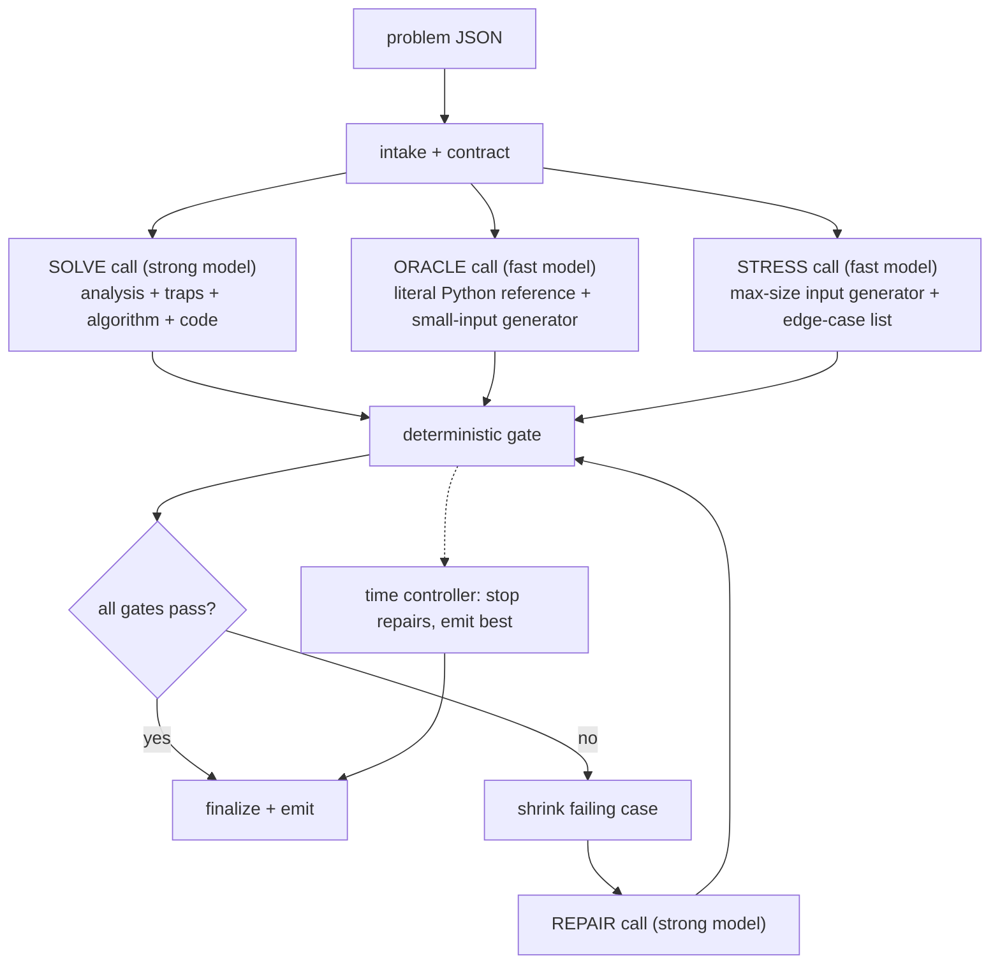

# ChallengeBox AI Solver — Architecture

**See [`SOLVER.md`](SOLVER.md) for setup and usage.** This document is the design rationale.

**Status:** implementation-ready
**Deliverable:** a runnable tool: `python solve.py <problem.json> -o <solution file>`
**Scope:** one week, one developer

---

## 1. What is being scored

Each problem is worth 0 or 1. A point requires all of the following at once:

- solution file emitted before `deadline_s`;
- passes every hidden test, including edge cases and maximum-size inputs;
- obeys the language contract (Python: named function, stdlib only, no I/O; Rust: `fn main()`, stdin/stdout, stdlib only).

Consequences that shape the design:

- A compiling but wrong solution is worth the same as no solution. "Best effort" fallback is a consolation, not a feature.
- A correct but slow solution is worth nothing. Performance must be tested, not estimated.
- No public examples are guaranteed. All ten samples have none. The system must manufacture its own ground truth.
- Cost matters. The README asks for cost optimization in the architecture, so the design states a per-problem budget.

---

## 2. What the samples say

The ten problems in `samples/` are the specification. Reading them yields a consistent profile.

| Property | Observed |
|---|---|
| `public_examples` | empty in all ten (see §5.4.1: when non-empty, this is the only ground truth in the system that isn't manufactured by a model, and is treated accordingly) |
| `deadline_s` | 300 in all ten |
| Languages | 6 Python, 4 Rust |
| Statement length | 2–3 KB, dense, formal |
| A parameter ≥ 10^18 that forbids direct simulation | all ten |

### 2.1 Trap classes found in the samples

| Trap | Where it appears | What kills a naive solution |
|---|---|---|
| Counts up to 10^18 | run-length outcome counts, `repeat` factors, `default k`, demand `k`, capacities | any loop over the count |
| Structures that cannot be built | flattened schema layouts "may be enormous"; DAG unfolding is exponential; "do not enumerate individual cells" | materializing the structure |
| Persistence and branching | versions created from any earlier version `b < i` | copying state per version |
| Unbounded range reversal | 200k `reverse(left, right)` ops with no bound on total length | list slicing, O(n²) |
| Deep recursion in Python | path depth "may be linear in the node count" (250k) | any recursive traversal |
| Big integers in Rust | sums and products of values up to 10^18 | `i64`/`u64` overflow |
| Custom Unicode rules | grapheme rules stated in the problem, deliberately not Unicode's | a model applying the "real" algorithm from memory |
| Wording that redefines behavior | "implicitly returns error after runs are exhausted", "restoration writes even if another activation changed the cell", "disregard every removed tab other than the selected tab" | reading the general idea instead of the sentence |

### 2.2 Contracts stated in the samples

Python problems say: deterministic, stdlib only, no I/O, no global state, do not mutate supplied arguments, return exact types.

Rust problems say: one program with `fn main()`, stdlib only, no `unsafe`, no filesystem, no network, no nondeterminism, stdin/stdout only, output compared as ASCII-whitespace-separated tokens.

Every one of these is mechanically checkable. Section 6 checks them.

### 2.3 The good news

Every sample is a state machine or simulation with a literal, small-scale interpretation. A brute-force reference that follows the statement sentence by sentence is always writable for tiny inputs. That reference is the ground truth the hidden tests withhold, so building it is mandatory, not optional.

---

## 3. Design principles

1. **The statement is the spec, not the model's memory.** Every prompt instructs the model to derive rules from the text and to flag where the text contradicts a well-known algorithm.
2. **Evidence beats confidence.** A model saying "correct" is not evidence. Compilation, contract checks, differential agreement with an independent oracle, and a passed max-size stress run are.
3. **Independence is the source of truth.** The oracle is generated in a separate context, from the statement alone, in Python regardless of target language, with instructions to be literal and slow. It never sees the candidate.
4. **Speed is a gate, not an audit.** Every candidate runs on a generated maximum-size input under a wall-clock limit before it can be finalized.
5. **The deadline is a clock, not a prompt.** A monotonic budget controller assigns every model call and every subprocess a timeout derived from time remaining.
6. **Few calls, run in parallel.** Roughly five serious model calls fit in 300 seconds. Independent calls are issued concurrently.
7. **Lazy plumbing.** One provider, one CLI command, five source files. Effort goes into verification, not scaffolding.

---

## 4. Pipeline



The three generation calls run concurrently. The gate is deterministic and costs no tokens. The repair loop runs at most twice against a semantic (behavioral) failure and, independently, at most twice against a mechanical (static/compile) one — see §5.7. The time controller can interrupt at any point and finalize.

### 4.1 Time budget for a 300-second problem

Usable time is `deadline_s` minus a 15-second safety margin. Phases are expressed as percentages so other deadlines scale.

| Window (s) | Share | Phase | Allowed |
|---:|---:|---|---|
| 0–5 | 2% | intake | parse, validate, build contract, start clock |
| 5–95 | 30% | generate | three concurrent model calls, each capped at `[phases].generate_call_share` (config.toml, default 0.55) of usable time — since they run concurrently, the phase costs max() of the three, not their sum, so each can get most of the phase rather than a third of it; role caps underneath: strong 120 s, fast 150 s |
| 95–115 | 7% | gate | compile, contract checks, differential, stress |
| 115–235 | 40% | repair | up to two shrink → repair → gate cycles, each capped at 60 s |
| 235–270 | 12% | settle | no new model calls; the last gate result stands; write report |
| 270–285 | 5% | emit | write the solution file atomically |
| 285–300 | 5% | margin | reserved; never scheduled |

The windows above are advisory, not enforced boundaries: the only phase cutoff the orchestrator
actually checks is the repair loop's (it will not start another repair once `Budget.phase()` has left
`repair`). What guarantees the deadline is `step_timeout` — every model call and every subprocess is
capped at the remaining time minus a reserve — plus the `safety_margin_s` that is subtracted from
`deadline_s` before any of this arithmetic, not the phase table. That is deliberate: enforcing the
generate window as a hard cutoff would kill the ORACLE call at ~95 s, below its measured 38–128 s
latency, and a run with no oracle verifies nothing.

### 4.2 Why this fits

Serious reasoning calls take 20 to 90 seconds each. A sequential analyzer → architect → judge → coder → critic → tester → repairer chain is seven calls before the first verified candidate and does not fit. This design issues three calls at once, then spends the remaining time on deterministic checks and at most two repairs. Worst case is five model calls plus one optional adjudication call.

---

## 5. Stages

### 5.1 Intake

- Parse JSON; require `problem_id`, `language ∈ {python, rust}`, `statement`, `entrypoint`, `deadline_s > 0`.
- Compute `safe_deadline = monotonic() + deadline_s - margin`.
- Build the contract: Python → `def <entrypoint>(...)` must exist; Rust → `fn main()` must exist.
- Invalid input exits with code 2 before any model call.

### 5.2 SOLVE call (strong model, one call)

One structured response with four sections. Merging analysis and code into one call halves latency and keeps the analysis in the same context that writes the code, which is where it matters.

Required sections:

1. **Rules** — a numbered restatement of every behavioral sentence in the statement, quoting the text. Ambiguities listed separately with the chosen reading.
2. **Traps** — for each constraint, what a naive approach would do and why it fails. The prompt lists the trap classes from §2.1 as a checklist the model must address one by one.
3. **Algorithm** — data structures, complexity against the stated maximum sizes, overflow treatment, recursion treatment.
4. **Code** — in a fenced block with a fixed marker. The orchestrator extracts by marker, never by trusting prose.

Language-specific instructions baked into the prompt:

- Python: iterative traversals only; no globals; no mutation of arguments; no recursion on data whose depth can be large.
- Rust: read all stdin into one buffer, `BufWriter` for output, `i128`/`u128` for sums of 10^18 quantities, `BTreeMap` or sorted output where iteration order reaches stdout, no `unsafe`.

### 5.3 ORACLE call (fast model, concurrent)

Produces three Python functions in one response:

- `reference(args)` — the literal simulation. Told: "Follow the statement sentence by sentence. Loop where the statement loops. Build what the statement describes. Ignore efficiency. Inputs will be tiny." For Rust problems it takes the parsed stdin text and returns the expected stdout tokens.
- `gen(seed, size)` — a seeded generator of small valid inputs. Told to honor every validity constraint in the statement, to include boundary values (empty, single element, equal values, adjacent positions), and to include a `medium` mode with counts around 10^4 to 10^5 so closed-form arithmetic in the candidate is exercised where the literal reference still finishes in seconds.
- `validate(args)` — a pure predicate over the same arguments as `reference`: `True` if the input satisfies every precondition the statement states, `False` otherwise. Every input `gen` and the STRESS edge-case list produce is checked here before `reference` computes an expected output for it (§5.5) — this is what stops a differential run from comparing candidate against reference on input the statement itself calls invalid (e.g. repeated identifiers where the statement says distinct, or an operation naming an identifier that was never created). A validator that cannot decide should return `True` rather than guess.

The oracle is Python for both target languages. For Rust problems this gives a second language and free big integers, which removes the risk that oracle and candidate share an overflow.

The oracle writes the largest output of the three concurrent calls (three functions, not one), so it is reliably the slowest and the one most likely to hit its timeout. If the first attempt returns no `===ORACLE===` block at all (a timeout, most often), the orchestrator retries the ORACLE call exactly once — a local counter, not a `GateInputs` field — guarded by `budget.can_afford(130)` (the measured worst-case oracle latency is 128 s) so the retry never fires this close to the deadline. This is independent of `regenerate_oracle` (§5.7), which reissues the oracle for two different reasons, each with its own separate one-shot counter (§5.3.1 and §5.7).

Before any generated oracle or stress source is executed, a fixed preamble — `import random, math, itertools, collections, string, heapq, bisect` — is prepended to it. The prompt tells the model to *use* `random.Random(seed)` but never explicitly tells it to import anything, and one live run produced a module with no imports at all, whose `gen()` died with `NameError`. A duplicate import is harmless if the model already wrote one. The preamble is prepended to the exact string that gets written to disk as that run's `cand.py`, so any traceback line number always matches what's actually sitting in the run directory — it only differs from the raw LLM completion's own line count.

#### 5.3.1 Oracle self-repair: the CALL can succeed while the CODE crashes

The retry above reacts to the ORACLE call itself failing (timeout, empty reply). A different, later-discovered failure mode is silent by comparison: the call succeeds, `oracle_src` parses, but `reference()`, `gen()`, or `validate()` then raise at runtime on every input they're given — an f-string referencing an undefined name, a `gen()` unpacking its own tuple wrong, a missing import. `prepare_gate_inputs` already detects and records every one of these (`"reference failed on all small inputs: <traceback>"`, `"gen(medium) produced nothing: <traceback>"`), but until this fix nothing acted on the detection: no gate step fails (there is nothing to check against), so the run proceeds with zero verification and ships silently as `emitted_unverified`.

After `prepare_gate_inputs` returns, `verify.oracle_unusable(gi)` asks the one generic question that covers every variant of this failure without hardcoding which function or which tier broke: did the oracle yield **no usable case at all, in every generated tier** (`cases_small`, `cases_medium`, `cases_edge` all empty)? Public examples don't factor into this check either way — they're ground truth from the problem, not something the oracle produced, so they say nothing about whether the oracle itself is usable.

When the oracle is unusable and the budget can still afford one more oracle-shaped call (`[limits].oracle_selfrepair_afford_s`, same cost profile as the initial call and its retry), the orchestrator calls `regenerate_oracle` — the same function §5.7's adjudication path uses — passing it the collected failure notes (the actual tracebacks the broken code produced) as the extra context appended to the statement, so the model can see exactly what its own code did wrong. `prepare_gate_inputs` then reruns against whatever new source comes back.

This has its **own one-shot counter**, `GateInputs.oracle_selfrepairs`, entirely independent of `oracle_regens` (§5.7's adjudication counter) — `regenerate_oracle` takes a `counter` argument naming which field to increment, so the two recovery paths never share a budget. A run can recover from a broken oracle early on via self-repair and still adjudicate a genuine candidate/oracle disagreement later via the repair loop; both can fire, once each, in the same run. Both counts are reported (`oracle_selfrepaired`, `oracle_regenerated`), and the trigger is logged distinctly (`oracle.selfrepair ...`) so it's visible in `report.json`'s `events` separately from an adjudication regeneration (`oracle.regen ...`).

### 5.4 STRESS call (fast model, concurrent)

Produces `gen_max(seed)` — one input at every stated maximum simultaneously (max N, max Q, max values, max nesting, deepest recursion path, worst-case operation mix), plus a short list of hand-picked edge cases as literal inputs.

For Rust, both `EDGES` entries and `gen_max`'s output are stdin text, and each is dedented per line (leading/trailing whitespace stripped on every line) before it reaches the gate. Model-written `EDGES` are Python triple-quoted string literals indented to match the surrounding list, so every continuation line inherits that indentation; fed verbatim, a line-oriented Rust parser sees `"    41".parse::<u64>()` and fails. The judge never sends indented input — the README defines Rust I/O as ASCII-whitespace-separated tokens — so the indentation is purely source formatting and is stripped, not preserved.

If `gen_max` fails (raises, or produces nothing) and at least one `medium`-tier case exists, the stress input falls back to the largest of those medium cases — "largest" measured as `len(str(case.input))`, which is generic across a Python argument tuple (its `str()` scales with total content) and a Rust stdin string (its `str()` is the string itself) without knowing anything about the problem's shape. This gives the timing check *something* to run rather than skipping it outright, but a medium case is capped far below `gen_max`'s target scale — it is not a maximum-size input. The resulting `stress` evidence is marked `detail.degraded` so this weaker signal is never read as a real max-size check. With no medium case either, the stress step is skipped exactly as before.

The same `detail.degraded` marker covers thin coverage. A `diff_small` or `diff_medium` step that passed on fewer cases than `[limits] min_cases_small` / `min_cases_medium` (config.toml; defaults 30 and 5 against the 200/20 targets) is marked degraded by `run_gate`: agreement on a handful of inputs means the oracle's `gen()` mostly crashed or its `validate()` rejected most of what it produced, and one run was observed shipping as a full pass on 48 small and 4 medium cases. An empty tier is `skipped`, not degraded. In the finalizer, any evidence carrying `detail.degraded` counts exactly like a skipped step: the status becomes `emitted_unverified` rather than `passed_all_gates`, and `benchmark.md` shows the cell as `degraded`. The gate order and the repair loop are unaffected — degraded evidence still *passed*; it is only weaker than the name of the step claims.

### 5.5 Deterministic gate

Runs in order, cheapest first, and stops at the first failure so the repair prompt is focused.

1. **Static contract** — §6.
2. **Compile / import** — Rust: `rustc -O -C overflow-checks=on --edition 2021`. Python: `compile()` then import in a subprocess.
3. **Public examples** — `problem.public_examples`, compared directly, only present if the problem shipped any (§5.4.1).
4. **Edge cases** — the literal cases from STRESS, compared against `reference`.
5. **Differential, small** — 200 seeded cases from `gen(seed, "small")`, candidate vs `reference`.
6. **Differential, medium** — 20 seeded cases from `gen(seed, "medium")`.
7. **Behavioral contract** — §6.3 checks (mutation, global state, nondeterminism), run on the same cases.
8. **Stress** — `gen_max` input, release build (`overflow-checks=off`, for a realistic timing measurement), wall-clock limit (default Python 5 s, Rust 2 s, configurable; the real judge limits are unknown and this is recorded as an assumption).
9. **Overflow (Rust only)** — immediately after stress, so the timing run above happens first on a warm cache and this step can't mask a stress timeout. Reruns the same `gen_max` input on the overflow-checked binary already compiled by step 2 (reused, not recompiled). This is the only place a genuinely maximum-size input meets an overflow-checked build: step 2's checked build is only ever exercised by the small/medium differential inputs, which are far too small to overflow i64. A panic here (Rust prints `attempt to add with overflow` and similar) fails the step. **This does not check the output is correct** — the oracle is a literal Python reference and cannot produce an expected answer at maximum scale in reasonable time — it only proves no arithmetic operation overflowed. Skipped (not failed) when the problem is Python (arbitrary-precision integers, nothing to overflow), when there is no stress input, or when the budget is exhausted.

#### 5.4.1 Public examples: the one non-model-generated evidence source

`Problem.load` has always parsed `public_examples`, but until this fix nothing downstream consumed it — every sample in `samples/` ships an empty list, which is exactly why the gap went unnoticed. When a hidden problem does ship examples, they are the single most trustworthy evidence available: real input/output pairs from whoever set the problem, not a model's guess at either the algorithm or the ground truth.

Parsing is defensive by necessity — the shape is whatever the problem author chose, sight unseen. `verify._parse_public_examples` recognizes a dict with an input key (`input`/`args`/`in`/`params`) and an output key (`output`/`expected`/`result`/`out`/`answer`), or a bare two-element `[input, output]` pair; anything else is skipped with a note (`public_examples[i]: unrecognized shape, skipped`) rather than guessed at or allowed to crash the run.

These become `GateInputs.cases_public` — and they are treated differently from every other case tier in three ways:

- **Never validated.** They don't pass through the oracle's `validate()` (§5.5's input-validation paragraph): they're already known-good, and running an unrelated model-written predicate over them could only incorrectly discard real ground truth.
- **Never dropped on a `reference()` disagreement.** Every other tier throws away an input `reference()` can't produce an answer for. A public example is never thrown away — if the oracle's `reference()` disagrees with (or crashes on) a public example, `_check_public_against_oracle` reads that as evidence **the oracle is wrong**, not the example: it's recorded in `gate_inputs.notes` and attached to the `diff_public` evidence's `oracle_disagreements` detail, and the public example is still checked against the candidate exactly as given.
- **Run first.** `diff_public` is its own evidence kind, run in `run_gate` immediately after compile/import and before any generated tier, so a candidate that fails real ground truth fails fast on the most trustworthy evidence in the system, before spending time on model-manufactured cases.

With no public examples — the overwhelming common case — `cases_public` is empty and the `diff_public` step is not added to the evidence list at all; the gate is byte-for-byte what it was before this existed.

**Input validation, before steps 3–5.** Every input feeding those three steps (STRESS edge cases and both `gen` tiers) is first checked against the oracle's own `validate`, batched the same way as the `reference` pass. An input `validate` rejects, or raises on, is dropped as invalid before `reference` ever computes an expected output for it, so the differential never burns a case — or a repair attempt — chasing a candidate/oracle disagreement on input the statement itself forbids. Two safety rules keep this from doing more harm than good: if `validate` would reject *every* input in a tier, it is distrusted instead — all inputs for that tier are kept exactly as before, and the report records that the validator was skipped; and an oracle with no `validate` function at all behaves exactly as it did before this feature existed, with its own distinct skip reason in the report. This buys confidence that inputs reaching the gate satisfy the preconditions the statement states; **it does not buy correctness of `reference` itself** — an oracle whose `reference` misreads the statement can still be internally consistent with its own `validate` and pass every check.

Each step produces an `Evidence` record: kind, passed, case count, duration, and the failing input if any.

When there is no oracle source at all (both the first attempt and its one retry produced no `===ORACLE===` block), every differential/behavior/stress step is `skipped` rather than run, which makes `all_passed()` true even though nothing was actually checked. This is deliberately *not* turned into a candidate-repair failure — repairing the candidate cannot conjure an oracle, and it would burn both repair attempts for nothing — so the run's status is still the accurate `emitted_unverified`. What changes is the log: this case is logged as `gate.unverifiable`, naming why (from `gate_inputs.notes`), instead of `gate.passed`, so the log doesn't read as a success for a run that verified nothing.

### 5.6 Shrink

On a differential failure, a bounded greedy shrink (max 3 seconds): drop list elements, halve integers, shorten strings, drop trailing operations, keep the change only if the failure persists. A four-line counterexample makes the repair call both cheaper and more accurate than a 300-line one. Shrinking only applies to Python's structured arguments; for Rust, where the failing input is stdin text, `shrink` returns the case unshrunk and the repair prompt gets the original counterexample.

### 5.7 REPAIR call (strong model, two independent budgets)

Input: statement, the current code, the gate step that failed, the shrunk input, expected vs actual (each shown as `repr()` *and* its Python type, so an empty tuple and an empty list — indistinguishable by eye, `()` vs `[]`, but not by type — can't be mistaken for the same value), and the time remaining. Instruction: smallest change that fixes the demonstrated failure; keep the public contract; do not switch algorithms unless the failure proves the algorithm wrong. The model is first required to name, in one sentence, the specific expression or line producing the wrong value, then change only what that sentence names — a whole-approach rewrite is almost never the right response to one failing input, and a model that believes the approach itself is wrong is told to say so rather than rewrite silently. When the candidate being repaired is itself the output of an earlier repair, the prompt says so explicitly: the earlier failing input, a diff of what that repair changed, and a flat statement that the change did not fix the case — so the model doesn't re-propose the same edit.

**Two counters, not one.** A gate failure of kind `static` or `compile` is mechanical (a missing import, a missing `mut`) rather than a semantic defect, and is charged against `[limits].max_syntax_repairs` (default 2). Every other failure kind (`diff_*`, `behavior`, `stress`, `overflow`) is charged against `[limits].max_repairs` (default 2). The two budgets are independent — a run can spend up to `max_syntax_repairs` fixing compile errors *and* up to `max_repairs` fixing an algorithmic bug, but a `static` failure can never crowd out a semantic repair attempt or vice versa. Both counts (`repairs`, `syntax_repairs`) are in the report. The overall repair loop is still bounded by the same phase/budget/cost checks as before (`run.budget.phase()`, `can_afford(60)`, `max_cost_usd_per_problem`).

**Adjudication.** When candidate and oracle disagree, the oracle may be the wrong one. The repair prompt is told this and asked to hand-trace the shrunk case against the statement and say which side is wrong. If it names the oracle, `verify.regenerate_oracle` is called with the disputed input/expected pair and the model's trace as extra context, incrementing `GateInputs.oracle_regens`; it fires at most once (`gi.oracle_regens == 0` gates the call). Regeneration is given the same generous timeout as the original ORACLE call — derived from `[phases].generate_call_share`, not a separate smaller fraction — because it writes the same `reference`/`gen`/`validate` functions and is just as likely to need the full span; `step_timeout` still caps it to whatever budget remains. This is the same `regenerate_oracle` function §5.3.1 uses for self-repair, parameterized by which counter to increment (`counter="oracle_regens"` here vs. `"oracle_selfrepairs"` there) so the two one-shot budgets never collide — both can fire, once each, in the same run.

After every repair the full gate reruns, and every previously failing case is kept as a regression case.

### 5.8 Finalize

The finalizer picks the candidate that passed the most gate steps, preferring later candidates on ties. It writes `report.json` before the solution file, so a failure writing one never loses the other. A candidate that fails to compile (Rust) or fails a gate step is still written — that scores 0 either way, and a missing file is worse than a wrong one — and the run exits 1. Only a genuinely empty SOLVE reply (no `===CODE===` block and no reply text to fall back to) leaves nothing to write; that case exits 3 and is recorded in the report as `status: "no_candidate"`. If the reply had no `===CODE===` block but was non-empty, the raw reply text is written verbatim as a last-resort candidate instead, so a file exists whenever the model produced any output at all.

---

## 6. Contract and behavior checks

### 6.1 Python static

- `ast.parse` succeeds; the entrypoint is a top-level `def`.
- Every import is in `sys.stdlib_module_names`.
- No `open`, `input`, `print`, `sys.stdin`, `sys.stdout`, `os.system`, `subprocess`, `socket`, `random` without a seed.
- Recursion smell: a function that calls itself over the input structure triggers a warning that feeds the stress step; `sys.setrecursionlimit` is allowed but the stress input must still pass.

### 6.2 Rust static

- `fn main()` present. No `extern crate`, no `unsafe`, no `std::fs`, `std::net`, `std::process::Command`, `std::env::args`.
- Warn on `HashMap`/`HashSet` iteration reaching output; nondeterminism check in §6.3 catches the actual bug.

### 6.3 Behavioral (both languages, run inside the gate)

- **Mutation:** deep-copy the arguments, call, compare. Failure is a hard fail for Python problems.
- **Global state:** in one process call A, then B, then A again; the two A results must match.
- **Nondeterminism:** run the differential batch in two separate processes; results must match. Rust `HashMap` seeds differ per process, so this catches order-dependent output.
- **Overflow:** Rust builds run with `overflow-checks=on` for compile and the small/medium/edge differential tiers, and separately, right after stress, the same checked binary is rerun against the max-size `gen_max` input (§5.5 step 8) — the only overflow check that runs at a scale large enough to actually trigger a silent i64 wrap. A panic is an overflow finding with the input attached; the arithmetic result itself is still not checked for correctness at that scale.

---

## 7. How the three README questions are answered

### 7.1 How traps are found and handled

- The SOLVE prompt carries the §2.1 trap checklist and must address each class explicitly against the stated bounds before writing code.
- The stress gate turns "would this be too slow" from an opinion into a measurement.
- The medium-magnitude differential tier exercises the closed-form and structural shortcuts the traps force, at sizes where the literal oracle can still confirm them.
- Overflow checks, mutation checks, and the deep-recursion stress input catch the trap classes that are invisible to small tests.

### 7.2 How a solution is verified without public examples

- An independent literal oracle written from the statement alone, in Python, in a separate context.
- Every generated and literal input is checked against the oracle's own `validate` predicate before it is used, so an input the statement itself would call invalid never reaches a differential comparison (a validator that rejects everything is distrusted and ignored; an oracle with no validator behaves exactly as before). This discards inputs the statement rules out — it does not make `reference` itself correct.
- Seeded differential testing at small and medium magnitude, plus literal edge cases.
- Behavioral contract checks for mutation, state, and determinism.
- A max-size stress run under a wall-clock limit.
- For Rust, the same max-size input rerun on an overflow-checked build, to catch a silent i64 wrap that timing-only stress can't see — this proves the absence of overflow, not the correctness of the result (the oracle can't produce an expected answer at that scale).
- Adjudication when candidate and oracle disagree, with the oracle regenerated at most once.
- The report lists which layers passed, which failed, and which could not run. It never says "verified"; it says what was checked.

### 7.3 What happens when time runs out

The controller is a monotonic clock, and every step is given `min(step_cap, remaining - reserve)`.

1. **Entering the repair window with a failing candidate:** repairs continue while a full cycle (60 s) still fits before the settle window.
2. **Entering settle:** no new model calls are made and no candidate is re-gated; the last gate result for each candidate stands as-is, and the finalizer picks the best of what already exists.
3. **Entering emit:** whatever candidate ranks best is written, even if it failed differential testing, because an unverified answer has nonzero expected value and a missing file has none. The report records exactly which gates it failed.
4. **A model call overruns:** it is cancelled at its timeout; the orchestrator proceeds with whatever candidates exist. The strong SOLVE call is the only step that can leave the system with nothing, so it gets the largest share of the budget and nothing else waits on it once the fast calls return.
5. **A subprocess hangs:** killed by process group at its timeout; treated as a stress failure.

The first compiling candidate is checkpointed immutably. A repair that fails to compile is discarded, not emitted.

---

## 8. Cost

### 8.1 Model roles

| Call | Model tier | Count per problem | Approx. tokens in / out |
|---|---|---:|---:|
| SOLVE | strong reasoning | 1 | 3k / 8k |
| ORACLE | fast | 1 (+1 on a timeout retry, +1 more on adjudication) | 2k / 3k |
| STRESS | fast | 1 | 2k / 2k |
| REPAIR | strong reasoning | 0–2 | 6k / 5k each |

Worst case is roughly 25k input and 30k output tokens per problem. Monetary cost is computed from prices in the config file and reported per run; if prices are not configured the report says "cost unavailable" rather than guessing.

### 8.2 Levers

- Hard caps: 6 model calls, 2 semantic repairs + 2 syntax repairs (independent budgets, §5.7), 1 oracle regeneration, 60k output tokens per problem.
- The statement and trap checklist are the shared prompt prefix on every call, so provider prompt caching applies where available.
- The gate is free. Every token-spending step is preceded by a free step that can end the run early.
- Fast-model calls never touch the algorithm. Strong-model calls never generate test scaffolding.

---

## 9. Sandbox

Generated code is untrusted. Every execution:

- runs in a fresh temporary directory in a separate process group;
- receives `PATH`, `HOME` (the real user home, needed by the rustc proxy) and `LANG`, nothing else;
- gets a wall-clock timeout, capped stdout/stderr, and a memory cap (`RLIMIT_DATA`, `RLIMIT_AS` where the platform supports it) from `config.toml`'s `[limits] mem_mb`, threaded through to both the Rust binary and the Python harness process — `sandbox.run_python_cases` takes `mem_mb` and forwards it to `run_cmd` exactly as the Rust path already did, so a changed `mem_mb` actually changes Python candidate behavior instead of silently running at `run_cmd`'s hardcoded default (invisible before this fix only because the two numbers happened to coincide);
- receives arguments as an array, never through a shell;
- is killed by process group on timeout and cleaned up.

**Python harness.** A trusted wrapper imports the candidate module by path and calls the entrypoint with arguments deserialized via `ast.literal_eval` from `repr` text. Results are written back the same way, so every fixture in the run directory is readable and re-runnable by hand.

**Rust harness.** Compile once per candidate hash (release with overflow checks for the gate; release without for the stress timing), then run each case with exact stdin bytes and compare token lists.

This is process isolation, not a hardened sandbox. Containers are a documented upgrade, not a dependency.

---

## 10. Repository layout

```text
challengebox/
├── README.md              # setup, one command, assumptions, limitations
├── ARCHITECTURE.md        # this document
├── solve.py               # CLI, orchestrator, budget controller, finalizer
├── llm.py                 # one OpenAI-compatible client, any provider by config: structured output, timeout, usage capture
├── sandbox.py             # python/rust runners, static contract checks
├── verify.py              # differential, medium tier, behavioral checks, stress, shrink
├── prompts/
│   ├── solve.md
│   ├── oracle.md
│   ├── stress.md
│   └── repair.md
├── config.toml            # models, prices, limits, safety margin
├── tests/
│   ├── test_budget.py     # fake clock: phase transitions, timeouts, emit-before-deadline
│   ├── test_sandbox.py    # contract checks, timeouts, cleanup, both languages
│   └── test_verify.py     # differential with a planted bug, shrink, mutation/state/nondeterminism
├── samples/               # provided problems, used as the benchmark suite
└── runs/                  # gitignored artifacts
```

Five source files. A second provider, a plugin system, exit-code taxonomies, and dashboards are deliberately absent; add them when a reviewer asks.

### 10.1 CLI

```bash
python solve.py samples/<id>.json -o out/solution.py
python solve.py samples/<id>.json -o out/main.rs --deadline-scale 0.25 --run-dir runs/debug
python solve.py --bench samples/ -o out/          # runs all, writes a summary table
```

Other flags: `--profile <name>` forces a `config.toml` profile (default: the first whose API key is set) and `--config <path>` a different config file;
`--run-dir` overrides where run artifacts land. There is no `--seed` flag — cases are generated with
`range(n)`, not a configurable seed.

Exit codes: 0 solution emitted and passed all gates; 1 solution emitted but with gate failures (details in report, including a non-compiling Rust candidate); 2 invalid input or a missing API key; 3 no candidate could be emitted at all (an empty SOLVE reply).

---

## 11. Run report

`runs/<problem_id>/report.json` contains: the normalized problem, every candidate source with its parent, every model call's role, model, latency, and token usage, every gate step's evidence, the shrunk counterexamples, the regression cases, the phase timeline, and the final status. No API keys or environment contents are persisted.

A run also emits a one-line-per-event log:

```text
[00:00.2] intake        lang=rust deadline=300 safe=285
[00:04.9] solve.sent    model=strong
[00:05.0] oracle.sent   model=fast
[00:05.0] stress.sent   model=fast
[00:41.3] oracle.done   tokens=1.9k/2.7k
[01:18.7] solve.done    tokens=3.1k/7.4k
[01:21.0] gate.compile  ok  overflow_checks=on
[01:29.4] gate.diff     FAIL seed=1842 case=73
[01:31.1] shrink        ops=4
[02:04.0] repair.done   c1->c2
[02:19.8] gate.diff     ok cases=200
[02:23.1] gate.medium   ok cases=20
[02:24.5] gate.behavior ok
[02:27.9] gate.stress   ok 0.81s
[02:28.3] emit          candidate=c2 status=passed_all_gates
```

---

## 12. Build order

Ordered by value, not by layer. Each step ends with a runnable check.

1. **Sandbox + contract checks** (`sandbox.py`): both languages compile and run a hand-written solution with timeouts and cleanup. Test: a hanging program is killed; a mutating function is caught.
2. **Budget controller** (`solve.py`): fake-clock tests prove emit happens before the deadline under every phase.
3. **One provider + SOLVE prompt** (`llm.py`, `prompts/solve.md`): one sample produces a compiling candidate.
4. **Oracle + differential + shrink** (`verify.py`, `prompts/oracle.md`): a planted off-by-one is caught and shrunk to a tiny case.
5. **Stress gate** (`prompts/stress.md`): a planted O(n²) solution is rejected.
6. **Repair loop + adjudication**: the planted bug from step 4 flows through shrink → repair → regression.
7. **Behavioral checks**: mutation, global state, nondeterminism.
8. **Benchmark all ten samples**; tune prompts from failures; write the README with the results table.

Steps 1–5 are the MVP. If time is short, step 7 is the first to cut, then step 6's adjudication.

---

## 13. Benchmark reporting

| Problem | Lang | Compiles | Diff small | Diff medium | Behavior | Stress | Repairs | Calls | Tokens | Elapsed | Hidden tests |
|---|---|---|---|---|---|---|---:|---:|---:|---:|---|
| `<id>` | py/rs | yes/no | pass/fail/n.a. | … | … | … | 0–2 | n | in/out | s | unknown |

"Pass" means passed the local gates. The hidden-test column is always "unknown" because the evaluator is not available. The README states this plainly.

---

## 14. Known limitations

- **Shared misreading.** Oracle independence reduces, but does not eliminate, the chance that both the candidate and the oracle misread the same sentence. Adjudication and the literal-trace instruction are the mitigations; a wrong shared reading still produces a confident wrong answer.
- **Judge time limits are unknown.** The stress thresholds are guesses recorded in the report. A solution that passes locally at 4 s may fail a 2 s judge.
- **Large-magnitude correctness is still not verified.** Behavior at 10^18 is inferred from agreement at the medium differential tier (10^5); the max-scale stress input is only checked for absence of Rust integer overflow (§5.5 step 8) and wall-clock timing, never for a correct output — the oracle cannot produce an expected answer at that scale. A bug that only appears above the medium tier and does not manifest as an overflow (e.g. a wrong-but-non-overflowing formula) is not caught.
- **Process isolation only.** Generated code runs as the invoking user with resource limits, not in a container.
- **Model latency variance.** A slow strong-model response compresses the repair window; the controller adapts but cannot create time.
- **Rust stress timing includes process spawn overhead.** The measured duration covers process start, not just the candidate's compute; on this machine that overhead is roughly 0.5 s, which makes the effective Rust stress limit tighter than the configured `stress_limit_rust_s`.
- **The benchmark has never been run against a live model.** No `OPENROUTER_API_KEY` was available in the development environment, so `benchmark.md` for the ten samples does not yet exist and the pipeline has only been exercised through `FakeLLM` in tests.

---

## 15. Open parameters

The README fixes the interface: a problem JSON in, a solution file out. The remaining unknowns are held in `config.toml` with defaults and are not blockers:

- judge CPU time limits (default: Python 5 s, Rust 2 s);
- Python and Rust versions (default: whatever is on `PATH`, recorded in the report);
- whether concurrent model calls are permitted (default: yes; a flag serializes them);
- model names and prices (default: one strong tier, one fast tier, prices unset → cost reported as unavailable).
