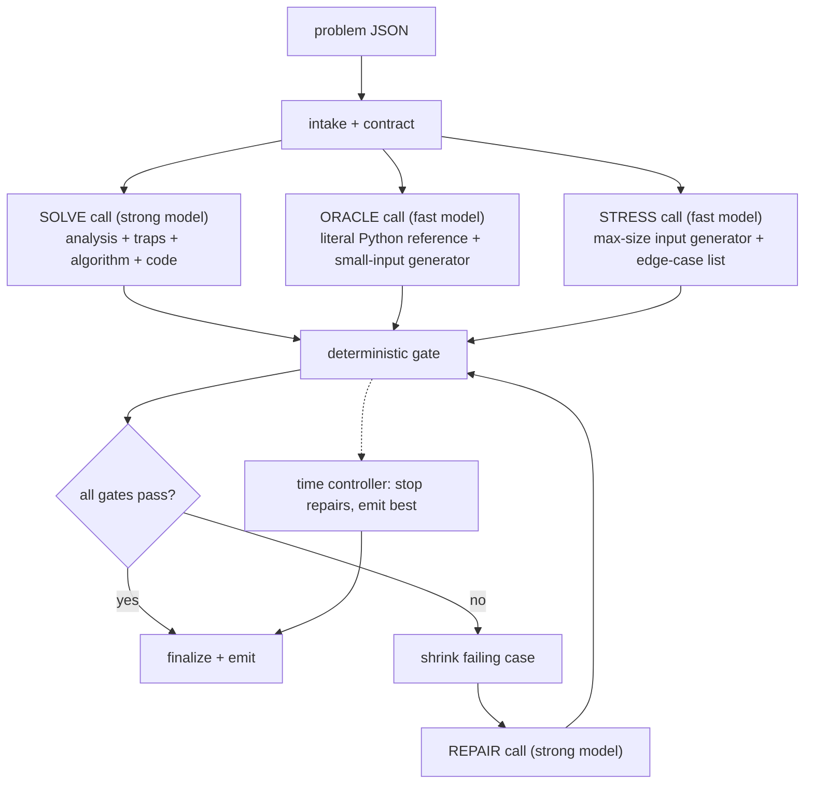

# ChallengeBox AI Solver — Architecture

**Status:** implementation-ready
**Deliverable:** a runnable tool: `python solve.py <problem.json> -o <solution file>`
**Scope:** one week, one developer

---

## 1. What is being scored

Each problem is worth 0 or 1. A point requires all of the following at once:

- solution file emitted before `deadline_s`;
- passes every hidden test, including edge cases and maximum-size inputs;
- obeys the language contract (Python: named function, stdlib only, no I/O; Rust: `fn main()`, stdin/stdout, stdlib only).

Consequences that shape the design:

- A compiling but wrong solution is worth the same as no solution. "Best effort" fallback is a consolation, not a feature.
- A correct but slow solution is worth nothing. Performance must be tested, not estimated.
- No public examples are guaranteed. All ten samples have none. The system must manufacture its own ground truth.
- Cost matters. The README asks for cost optimization in the architecture, so the design states a per-problem budget.

---

## 2. What the samples say

The ten problems in `samples/` are the specification. Reading them yields a consistent profile.

| Property | Observed |
|---|---|
| `public_examples` | empty in all ten |
| `deadline_s` | 300 in all ten |
| Languages | 6 Python, 4 Rust |
| Statement length | 2–3 KB, dense, formal |
| A parameter ≥ 10^18 that forbids direct simulation | all ten |

### 2.1 Trap classes found in the samples

| Trap | Where it appears | What kills a naive solution |
|---|---|---|
| Counts up to 10^18 | run-length outcome counts, `repeat` factors, `default k`, demand `k`, capacities | any loop over the count |
| Structures that cannot be built | flattened schema layouts "may be enormous"; DAG unfolding is exponential; "do not enumerate individual cells" | materializing the structure |
| Persistence and branching | versions created from any earlier version `b < i` | copying state per version |
| Unbounded range reversal | 200k `reverse(left, right)` ops with no bound on total length | list slicing, O(n²) |
| Deep recursion in Python | path depth "may be linear in the node count" (250k) | any recursive traversal |
| Big integers in Rust | sums and products of values up to 10^18 | `i64`/`u64` overflow |
| Custom Unicode rules | grapheme rules stated in the problem, deliberately not Unicode's | a model applying the "real" algorithm from memory |
| Wording that redefines behavior | "implicitly returns error after runs are exhausted", "restoration writes even if another activation changed the cell", "disregard every removed tab other than the selected tab" | reading the general idea instead of the sentence |

### 2.2 Contracts stated in the samples

Python problems say: deterministic, stdlib only, no I/O, no global state, do not mutate supplied arguments, return exact types.

Rust problems say: one program with `fn main()`, stdlib only, no `unsafe`, no filesystem, no network, no nondeterminism, stdin/stdout only, output compared as ASCII-whitespace-separated tokens.

Every one of these is mechanically checkable. Section 6 checks them.

### 2.3 The good news

Every sample is a state machine or simulation with a literal, small-scale interpretation. A brute-force reference that follows the statement sentence by sentence is always writable for tiny inputs. That reference is the ground truth the hidden tests withhold, so building it is mandatory, not optional.

---

## 3. Design principles

1. **The statement is the spec, not the model's memory.** Every prompt instructs the model to derive rules from the text and to flag where the text contradicts a well-known algorithm.
2. **Evidence beats confidence.** A model saying "correct" is not evidence. Compilation, contract checks, differential agreement with an independent oracle, and a passed max-size stress run are.
3. **Independence is the source of truth.** The oracle is generated in a separate context, from the statement alone, in Python regardless of target language, with instructions to be literal and slow. It never sees the candidate.
4. **Speed is a gate, not an audit.** Every candidate runs on a generated maximum-size input under a wall-clock limit before it can be finalized.
5. **The deadline is a clock, not a prompt.** A monotonic budget controller assigns every model call and every subprocess a timeout derived from time remaining.
6. **Few calls, run in parallel.** Roughly five serious model calls fit in 300 seconds. Independent calls are issued concurrently.
7. **Lazy plumbing.** One provider, one CLI command, five source files. Effort goes into verification, not scaffolding.

---

## 4. Pipeline



The three generation calls run concurrently. The gate is deterministic and costs no tokens. The repair loop runs at most twice. The time controller can interrupt at any point and finalize.

### 4.1 Time budget for a 300-second problem

Usable time is `deadline_s` minus a 15-second safety margin. Phases are expressed as percentages so other deadlines scale.

| Window (s) | Share | Phase | Allowed |
|---:|---:|---|---|
| 0–5 | 2% | intake | parse, validate, build contract, start clock |
| 5–95 | 30% | generate | three concurrent model calls; strong call timeout 90 s, fast calls 40 s |
| 95–115 | 7% | gate | compile, contract checks, differential, stress |
| 115–235 | 40% | repair | up to two shrink → repair → gate cycles, each capped at 60 s |
| 235–270 | 12% | settle | no new model calls; rerun gate on the best candidate; write report |
| 270–285 | 5% | emit | write the solution file atomically |
| 285–300 | 5% | margin | reserved; never scheduled |

### 4.2 Why this fits

Serious reasoning calls take 20 to 90 seconds each. A sequential analyzer → architect → judge → coder → critic → tester → repairer chain is seven calls before the first verified candidate and does not fit. This design issues three calls at once, then spends the remaining time on deterministic checks and at most two repairs. Worst case is five model calls plus one optional adjudication call.

---

## 5. Stages

### 5.1 Intake

- Parse JSON; require `problem_id`, `language ∈ {python, rust}`, `statement`, `entrypoint`, `deadline_s > 0`.
- Compute `safe_deadline = monotonic() + deadline_s - margin`.
- Build the contract: Python → `def <entrypoint>(...)` must exist; Rust → `fn main()` must exist.
- Invalid input exits with code 2 before any model call.

### 5.2 SOLVE call (strong model, one call)

One structured response with four sections. Merging analysis and code into one call halves latency and keeps the analysis in the same context that writes the code, which is where it matters.

Required sections:

1. **Rules** — a numbered restatement of every behavioral sentence in the statement, quoting the text. Ambiguities listed separately with the chosen reading.
2. **Traps** — for each constraint, what a naive approach would do and why it fails. The prompt lists the trap classes from §2.1 as a checklist the model must address one by one.
3. **Algorithm** — data structures, complexity against the stated maximum sizes, overflow treatment, recursion treatment.
4. **Code** — in a fenced block with a fixed marker. The orchestrator extracts by marker, never by trusting prose.

Language-specific instructions baked into the prompt:

- Python: iterative traversals only, or an explicit thread with a large stack; no globals; no mutation of arguments; no recursion on data whose depth can be large.
- Rust: read all stdin into one buffer, `BufWriter` for output, `i128`/`u128` for sums of 10^18 quantities, `BTreeMap` or sorted output where iteration order reaches stdout, no `unsafe`.

### 5.3 ORACLE call (fast model, concurrent)

Produces two Python functions in one response:

- `reference(args)` — the literal simulation. Told: "Follow the statement sentence by sentence. Loop where the statement loops. Build what the statement describes. Ignore efficiency. Inputs will be tiny." For Rust problems it takes the parsed stdin text and returns the expected stdout tokens.
- `gen(seed, size)` — a seeded generator of small valid inputs. Told to honor every validity constraint in the statement, to include boundary values (empty, single element, equal values, adjacent positions), and to include a `medium` mode with counts around 10^4 to 10^5 so closed-form arithmetic in the candidate is exercised where the literal reference still finishes in seconds.

The oracle is Python for both target languages. For Rust problems this gives a second language and free big integers, which removes the risk that oracle and candidate share an overflow.

### 5.4 STRESS call (fast model, concurrent)

Produces `gen_max(seed)` — one input at every stated maximum simultaneously (max N, max Q, max values, max nesting, deepest recursion path, worst-case operation mix), plus a short list of hand-picked edge cases as literal inputs.

### 5.5 Deterministic gate

Runs in order, cheapest first, and stops at the first failure so the repair prompt is focused.

1. **Static contract** — §6.
2. **Compile / import** — Rust: `rustc -O -C overflow-checks=on --edition 2021`. Python: `compile()` then import in a subprocess.
3. **Edge cases** — the literal cases from STRESS, compared against `reference`.
4. **Differential, small** — 300 seeded cases from `gen(seed, "small")`, candidate vs `reference`.
5. **Differential, medium** — 30 seeded cases from `gen(seed, "medium")`.
6. **Behavioral contract** — §6.3 checks (mutation, global state, nondeterminism), run on the same cases.
7. **Stress** — `gen_max` input, release build, wall-clock limit (default Python 5 s, Rust 2 s, configurable; the real judge limits are unknown and this is recorded as an assumption).

Each step produces an `Evidence` record: kind, passed, case count, duration, and the failing input if any.

### 5.6 Shrink

On a differential failure, a bounded greedy shrink (max 3 seconds): drop list elements, halve integers, shorten strings, drop trailing operations, keep the change only if the failure persists. A four-line counterexample makes the repair call both cheaper and more accurate than a 300-line one.

### 5.7 REPAIR call (strong model, at most two)

Input: statement, the current code, the gate step that failed, the shrunk input, expected vs actual, and the time remaining. Instruction: smallest change that fixes the demonstrated failure; keep the public contract; do not switch algorithms unless the failure proves the algorithm wrong.

**Adjudication.** When candidate and oracle disagree, the oracle may be the wrong one. The repair prompt is told this and asked to hand-trace the shrunk case against the statement and say which side is wrong. If it names the oracle, the ORACLE call is reissued once with the disputed case and the model's trace; the oracle is never regenerated more than once.

After every repair the full gate reruns, and every previously failing case is kept as a regression case.

### 5.8 Finalize

The finalizer picks the candidate that passed the most gate steps, preferring later candidates on ties. It strips prose and fences, writes the solution atomically, and writes `runs/<problem_id>/report.json`. If no candidate compiled, it still writes the latest source, exits with code 3, and says so in the report.

---

## 6. Contract and behavior checks

### 6.1 Python static

- `ast.parse` succeeds; the entrypoint is a top-level `def`.
- Every import is in `sys.stdlib_module_names`.
- No `open`, `input`, `print`, `sys.stdin`, `sys.stdout`, `os.system`, `subprocess`, `socket`, `random` without a seed.
- Recursion smell: a function that calls itself over the input structure triggers a warning that feeds the stress step; `sys.setrecursionlimit` is allowed but the stress input must still pass.

### 6.2 Rust static

- `fn main()` present. No `extern crate`, no `unsafe`, no `std::fs`, `std::net`, `std::process::Command`, `std::env::args`.
- Warn on `HashMap`/`HashSet` iteration reaching output; nondeterminism check in §6.3 catches the actual bug.

### 6.3 Behavioral (both languages, run inside the gate)

- **Mutation:** deep-copy the arguments, call, compare. Failure is a hard fail for Python problems.
- **Global state:** in one process call A, then B, then A again; the two A results must match.
- **Nondeterminism:** run the differential batch in two separate processes; results must match. Rust `HashMap` seeds differ per process, so this catches order-dependent output.
- **Overflow:** Rust test builds run with `overflow-checks=on`; a panic is an overflow finding with the input attached.

---

## 7. How the three README questions are answered

### 7.1 How traps are found and handled

- The SOLVE prompt carries the §2.1 trap checklist and must address each class explicitly against the stated bounds before writing code.
- The stress gate turns "would this be too slow" from an opinion into a measurement.
- The medium-magnitude differential tier exercises the closed-form and structural shortcuts the traps force, at sizes where the literal oracle can still confirm them.
- Overflow checks, mutation checks, and the deep-recursion stress input catch the trap classes that are invisible to small tests.

### 7.2 How a solution is verified without public examples

- An independent literal oracle written from the statement alone, in Python, in a separate context.
- Seeded differential testing at small and medium magnitude, plus literal edge cases.
- Behavioral contract checks for mutation, state, and determinism.
- A max-size stress run under a wall-clock limit.
- Adjudication when candidate and oracle disagree, with the oracle regenerated at most once.
- The report lists which layers passed, which failed, and which could not run. It never says "verified"; it says what was checked.

### 7.3 What happens when time runs out

The controller is a monotonic clock, and every step is given `min(step_cap, remaining - reserve)`.

1. **Entering the repair window with a failing candidate:** repairs continue while a full cycle (60 s) still fits before the settle window.
2. **Entering settle:** no new model calls. The best candidate is re-gated once with a shorter differential batch. Regression cases are included.
3. **Entering emit:** whatever candidate ranks best is written, even if it failed differential testing, because an unverified answer has nonzero expected value and a missing file has none. The report records exactly which gates it failed.
4. **A model call overruns:** it is cancelled at its timeout; the orchestrator proceeds with whatever candidates exist. The strong SOLVE call is the only step that can leave the system with nothing, so it gets the largest share of the budget and nothing else waits on it once the fast calls return.
5. **A subprocess hangs:** killed by process group at its timeout; treated as a stress failure.

The first compiling candidate is checkpointed immutably. A repair that fails to compile is discarded, not emitted.

---

## 8. Cost

### 8.1 Model roles

| Call | Model tier | Count per problem | Approx. tokens in / out |
|---|---|---:|---:|
| SOLVE | strong reasoning | 1 | 3k / 8k |
| ORACLE | fast | 1 (+1 on adjudication) | 2k / 3k |
| STRESS | fast | 1 | 2k / 2k |
| REPAIR | strong reasoning | 0–2 | 6k / 5k each |

Worst case is roughly 25k input and 30k output tokens per problem. Monetary cost is computed from prices in the config file and reported per run; if prices are not configured the report says "cost unavailable" rather than guessing.

### 8.2 Levers

- Hard caps: 6 model calls, 2 repairs, 1 oracle regeneration, 60k output tokens per problem.
- The statement and trap checklist are the shared prompt prefix on every call, so provider prompt caching applies where available.
- The gate is free. Every token-spending step is preceded by a free step that can end the run early.
- Fast-model calls never touch the algorithm. Strong-model calls never generate test scaffolding.

---

## 9. Sandbox

Generated code is untrusted. Every execution:

- runs in a fresh temporary directory in a separate process group;
- receives an empty environment plus `PATH`;
- gets a wall-clock timeout, capped stdout/stderr, and `RLIMIT_AS` where the platform supports it;
- receives arguments as an array, never through a shell;
- is killed by process group on timeout and cleaned up.

**Python harness.** A trusted wrapper imports the candidate module by path and calls the entrypoint with arguments deserialized via `ast.literal_eval` from `repr` text. Results are written back the same way, so every fixture in the run directory is readable and re-runnable by hand.

**Rust harness.** Compile once per candidate hash (release with overflow checks for the gate; release without for the stress timing), then run each case with exact stdin bytes and compare token lists.

This is process isolation, not a hardened sandbox. Containers are a documented upgrade, not a dependency.

---

## 10. Repository layout

```text
challengebox/
├── README.md              # setup, one command, assumptions, limitations
├── ARCHITECTURE.md        # this document
├── solve.py               # CLI, orchestrator, budget controller, finalizer
├── llm.py                 # one provider client: structured output, timeout, usage capture
├── sandbox.py             # python/rust runners, static contract checks
├── verify.py              # differential, medium tier, behavioral checks, stress, shrink
├── prompts/
│   ├── solve.md
│   ├── oracle.md
│   ├── stress.md
│   └── repair.md
├── config.toml            # models, prices, limits, safety margin
├── tests/
│   ├── test_budget.py     # fake clock: phase transitions, timeouts, emit-before-deadline
│   ├── test_sandbox.py    # contract checks, timeouts, cleanup, both languages
│   └── test_verify.py     # differential with a planted bug, shrink, mutation/state/nondeterminism
├── samples/               # provided problems, used as the benchmark suite
└── runs/                  # gitignored artifacts
```

Five source files. A second provider, a plugin system, exit-code taxonomies, and dashboards are deliberately absent; add them when a reviewer asks.

### 10.1 CLI

```bash
python solve.py samples/<id>.json -o out/solution.py
python solve.py samples/<id>.json -o out/main.rs --deadline 120 --seed 7
python solve.py --bench samples/ -o out/          # runs all, writes a summary table
```

Exit codes: 0 solution emitted and passed all gates; 1 solution emitted with gate failures (details in report); 2 invalid input; 3 nothing compiled.

---

## 11. Run report

`runs/<problem_id>/report.json` contains: the normalized problem, every candidate source with its parent, every model call's role, model, latency, and token usage, every gate step's evidence, the shrunk counterexamples, the regression cases, the seed, the phase timeline, and the final status. No API keys or environment contents are persisted.

A run also emits a one-line-per-event log:

```text
[00:00.2] intake        lang=rust deadline=300 safe=285
[00:04.9] solve.sent    model=strong
[00:05.0] oracle.sent   model=fast
[00:05.0] stress.sent   model=fast
[00:41.3] oracle.done   tokens=1.9k/2.7k
[01:18.7] solve.done    tokens=3.1k/7.4k
[01:21.0] gate.compile  ok  overflow_checks=on
[01:29.4] gate.diff     FAIL seed=1842 case=73
[01:31.1] shrink        ops=4
[02:04.0] repair.done   c1->c2
[02:19.8] gate.diff     ok cases=300
[02:23.1] gate.medium   ok cases=30
[02:24.5] gate.behavior ok
[02:27.9] gate.stress   ok 0.81s
[02:28.3] emit          candidate=c2 status=passed_all_gates
```

---

## 12. Build order

Ordered by value, not by layer. Each step ends with a runnable check.

1. **Sandbox + contract checks** (`sandbox.py`): both languages compile and run a hand-written solution with timeouts and cleanup. Test: a hanging program is killed; a mutating function is caught.
2. **Budget controller** (`solve.py`): fake-clock tests prove emit happens before the deadline under every phase.
3. **One provider + SOLVE prompt** (`llm.py`, `prompts/solve.md`): one sample produces a compiling candidate.
4. **Oracle + differential + shrink** (`verify.py`, `prompts/oracle.md`): a planted off-by-one is caught and shrunk to a tiny case.
5. **Stress gate** (`prompts/stress.md`): a planted O(n²) solution is rejected.
6. **Repair loop + adjudication**: the planted bug from step 4 flows through shrink → repair → regression.
7. **Behavioral checks**: mutation, global state, nondeterminism.
8. **Benchmark all ten samples**; tune prompts from failures; write the README with the results table.

Steps 1–5 are the MVP. If time is short, step 7 is the first to cut, then step 6's adjudication.

---

## 13. Benchmark reporting

| Problem | Lang | Compiles | Diff small | Diff medium | Behavior | Stress | Repairs | Calls | Tokens | Elapsed | Hidden tests |
|---|---|---|---|---|---|---|---:|---:|---:|---:|---|
| `<id>` | py/rs | yes/no | pass/fail/n.a. | … | … | … | 0–2 | n | in/out | s | unknown |

"Pass" means passed the local gates. The hidden-test column is always "unknown" because the evaluator is not available. The README states this plainly.

---

## 14. Known limitations

- **Shared misreading.** Oracle independence reduces, but does not eliminate, the chance that both the candidate and the oracle misread the same sentence. Adjudication and the literal-trace instruction are the mitigations; a wrong shared reading still produces a confident wrong answer.
- **Judge time limits are unknown.** The stress thresholds are guesses recorded in the report. A solution that passes locally at 4 s may fail a 2 s judge.
- **Large-magnitude correctness.** Behavior at 10^18 is inferred from agreement at 10^5 plus overflow checks. A bug that only appears above the medium tier is not caught.
- **Process isolation only.** Generated code runs as the invoking user with resource limits, not in a container.
- **Model latency variance.** A slow strong-model response compresses the repair window; the controller adapts but cannot create time.

---

## 15. Open parameters

The README fixes the interface: a problem JSON in, a solution file out. The remaining unknowns are held in `config.toml` with defaults and are not blockers:

- judge CPU time limits (default: Python 5 s, Rust 2 s);
- Python and Rust versions (default: whatever is on `PATH`, recorded in the report);
- whether concurrent model calls are permitted (default: yes; a flag serializes them);
- model names and prices (default: one strong tier, one fast tier, prices unset → cost reported as unavailable).
